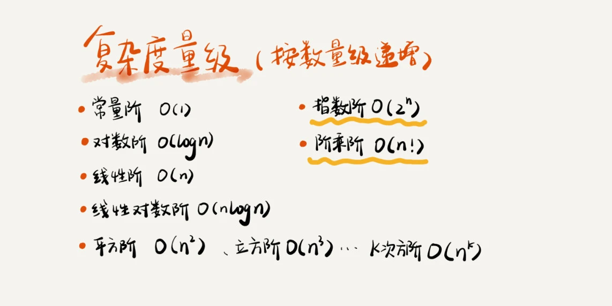

# 复杂度分析

## 为什么需要复杂度分析

复杂度分析是整个算法学习的精髓

执行代码，通过统计、监控，就能得到算法执行的时间和占用的内存大小。这种评估算法执行效率的方法是正确的的，但很多数据结构和算法的书籍叫“事后统计法”。但这种方法有很大局限性。

为什么还要做时间、空间复杂度分析呢？这种分析方法能比我实实在在跑一遍得到的数据更准确吗？

### 事后统计法局限性

#### 1.测试结果非常依赖测试环境

测试环境中硬件的不同会对测试结果有很大的影响。例如，同样一段代码，分别用 Intel Core i9 处理器和 Intel Core i3 处理器来运行，i9 处理器要比 i3 处理器执行的速度快很多。

#### 2.测试结果受数据规模的影响很大

对同一个排序算法，待排序数据的有序度不一样，排序的执行时间就会有很大的差别。极端情况下，如果数据已经是有序的，那排序算法不需要做任何操作，执行时间就会非常短。

除此之外，如果测试数据规模太小，测试结果可能无法真实地反映算法的性能。比如，对于小规模的数据排序，插入排序可能反倒会比快速排序要快！

### 时间复杂度

算法的执行时间与数据规模之间的增长关系

#### 1.只关注循环执行次数最多的一段代码

```java
int cal(int n) {
   int sum = 0;
   int i = 1;
   for (; i <= n; ++i) {
     sum = sum + i;
   }
   return sum;
 }
```

其中第 2、3 行代码都是常量级的执行时间，与 n 的大小无关，所以对于复杂度并没有影响。循环执行次数最多的是第 4、5 行代码，这两行代码被执行了 n 次，所以总的时间复杂度就是 O(n)。

#### 2. 加法法则：总复杂度等于量级最大的那段代码的复杂度

```java
int cal(int n) {
   int sum_1 = 0;
   int p = 1;
   for (; p < 100; ++p) {
     sum_1 = sum_1 + p;
   }

   int sum_2 = 0;
   int q = 1;
   for (; q < n; ++q) {
     sum_2 = sum_2 + q;
   }
 
   int sum_3 = 0;
   int i = 1;
   int j = 1;
   for (; i <= n; ++i) {
     j = 1; 
     for (; j <= n; ++j) {
       sum_3 = sum_3 +  i * j;
     }
   }
 
   return sum_1 + sum_2 + sum_3;
 }
```

这个代码分为三部分，分别是求 sum_1、sum_2、sum_3。我们可以分别分析每一部分的时间复杂度，然后把它们放到一块儿，再取一个量级最大的作为整段代码的复杂度。

那我们将这个规律抽象成公式就是：如果 T1(n)=O(f(n))，T2(n)=O(g(n))；那么 T(n)=T1(n)+T2(n)=max(O(f(n)), O(g(n))) =O(max(f(n), g(n))).

#### 3. 乘法法则：嵌套代码的复杂度等于嵌套内外代码复杂度的乘积

如果 T1(n)=O(f(n))，T2(n)=O(g(n))；那么 T(n)=T1(n)*T2(n)=O(f(n))*O(g(n))=O(f(n)*g(n)).

假设 T1(n) = O(n)，T2(n) = O(n²)，则 T1(n) * T2(n) = O(n³)。

```java
int cal(int n) {
   int ret = 0; 
   int i = 1;
   for (; i < n; ++i) {
     ret = ret + f(i);
   } 
 } 
 
int f(int n) {
  int sum = 0;
  int i = 1;
  for (; i < n; ++i) {
    sum = sum + i;
  } 
  return sum;
}
```

整个 cal() 函数的时间复杂度就是，T(n) = T1(n) * T2(n) = O(n*n) = O(n²)。

### 常见的复杂度



#### 1. O(m+n)、O(m*n)

讲一种跟前面都不一样的时间复杂度，代码的复杂度由两个数据的规模来决定

```java
int cal(int m, int n) {
  int sum_1 = 0;
  int i = 1;
  for (; i < m; ++i) {
    sum_1 = sum_1 + i;
  }

  int sum_2 = 0;
  int j = 1;
  for (; j < n; ++j) {
    sum_2 = sum_2 + j;
  }

  return sum_1 + sum_2;
}
```

m 和 n 是表示两个数据规模。无法事先评估 m 和 n 谁的量级大，所以在表示复杂度的时候，就不能简单地利用加法法则，省略掉其中一个。

所以，上面代码的时间复杂度就是 O(m+n)。我们需要将加法规则改为：T1(m) + T2(n) = O(f(m) + g(n))。但是乘法法则继续有效：T1(m)*T2(n) = O(f(m) * f(n))。

### 空间复杂度

表示算法的存储空间与数据规模之间的增长关系。

```java
void print(int n) {
  int i = 0;
  int[] a = new int[n];
  for (i; i <n; ++i) {
    a[i] = i * i;
  }

  for (i = n-1; i >= 0; --i) {
    print out a[i]
  }
}
```

第 2 行代码中，我们申请了一个空间存储变量 i，但是它是常量阶的，跟数据规模 n 没有关系，所以我们可以忽略。

第 3 行申请了一个大小为 n 的 int 类型数组，除此之外，剩下的代码都没有占用更多的空间，所以整段代码的空间复杂度就是 O(n)。

我们常见的空间复杂度就是 O(1)、O(n)、O(n2 )，像 O(logn)、O(nlogn) 这样的对数阶复杂度平时都用不到。

而且，空间复杂度分析比时间复杂度分析要简单很多。所以，对于空间复杂度，掌握刚我说的这些内容已经足够了。


