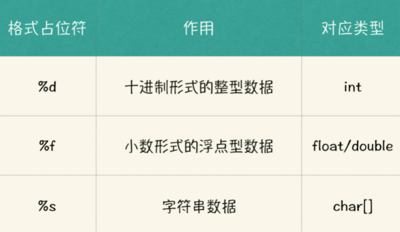

从今天开始，我将带你正式进入 C 语言的编程世界。我们总会听到这样一种说法：兴趣是最好的老师。引起你对编程的兴趣，就是今天这讲的目的。如果你之前对于 C 语言的认知还停留在黑白纯色阶段的话，今天就让我们一起来进入一个彩色的 C 语言

世界，来，跟我一起给它点儿颜色！

**今日任务**

先来看看今天这 10 分钟，我们要完成的任务。今天你将会学到如何设计一个读入字符串，并且按照字符串信息中规定的颜色，输出相应颜色文本内容的方法程序。例如当我们：

* 输入：red:color content， 输出红色的：color content
* 输入：blue:color content，输出蓝色的：color content
* 输入：yellow:color content，输出黄色的：color content


那么想完成这个任务，我们都需要做哪些准备呢？又有哪些概念需要我们理解和掌握的？

#### **1.** 输出函数：让计算机说出话

我还记得我当年学习 C 语言的时候，最兴奋的地方就是计算机可以根据我的“指令”打印出一句我想说的话来。这个功能虽然简单，但它也预示着我们可以初步“控制”计算机了。

下面我附了一段代码，代码后面有相应的中文说明，你可以先看看。

```c
#include <stdio.h> // 文件包含，之所以能使用 printf，跟这行代码有关

int main() { // 主函数部分，整个程序的入口位置
	printf("hello my friend!"); // 打印函数
	return 0; // 暂不介绍，不是重点
}
```

如果你在编译器中运行上面这段程序，就会看到如下一段输出：

```c
hello my friend！
```

printf 函数就是所谓的“输出函数”，现在你可以尝试在 printf 函数的双引号中间换一些其他内容，来试试效果了。

我学习计算机的时候，我的老师就让我把上面的代码敲了 N 遍，最后都成了肌肉记忆。现在想想，也是这么回事。

上面那段代码，如果你玩够了的话，可以将 printf 函数换成下面的内容，看看输出结果：

```c
1 printf("Hi, my friend:\n\tthis is the first day I know you.");
```

你所看到的输出内容，应该与下面这段内容相似：

```c
Hi, my friend: 
	this is the first day I know you.
```

我们看到有了换行效果，且第二行开头有了缩进。

你要是使用过 Word 的话，应该知道 Tab 键吧，对，\t 的效果就相当于在相应位置敲击了Tab 键， \n 的效果就相当于敲击了换行。在 C 语言中，\t、\n 都属于转义字符，还是和上面一样，它是 C 语言定义的规则，你也先不用问为什么，记住它，然后多用几次就可以了。下面这个表里，我还给出了一些更多的转义字符，你可以拿来玩一玩。


#### 2.类型与变量：组织语言让计算机理解你的意思

现实世界就像这个战场一样，是抽象的，而计算机的世界是具体的、可计算的。从现在开始，你应该注意学习如何将现实世界的“**信息**”，映射到计算机世界中“**数据**”的技巧。

下面我们来看一个简单的变量示例：

```c
#include <stdio.h> 

int main() { 
	int a = 167, b = 543; // 定义变量 a,b 
	printf("%d + %d = %d\n", a, b, a + b); 
	return 0; 
}
```

在上面的程序中，a、b 就是变量，167、543 就是数据。那么 167、543 这样的数据是什么类型呢？我们看到它们是整数，所以用的是 int 。可以看到，我们定义了两个整数型变量a、b，并把数据 167、543 分别放到了变量 a 和变量 b 里，进而实现了程序目的。

所以，这里我划个重点，**变量是用来存储数据的**。你理解了吧？

上面例子中的 printf 函数虽然复杂一点儿，但其实简单来说就只有如下两部分：

1. “%d + %d = %d\n”叫做**格式控制字符串**，其中 %d 是整型的“格式占位符”。

2. a, b, a + b 叫做**参数列表**，每一项依次对应一个“格式占位符”要输出的内容。

“格式占位符”与参数列表中的项一一对应，按照顺序，第一个 %d 与 a 对应，第二个%d 与 b 对应，第三个 %d 与 a+b 对应。在输出内容时，会被替换成为对应项的内容。例如，上述程序的输出结果如下图所示：

```js
167+543=710
```

我们利用 printf 函数输出了二者加法表达式的值。至此，这个程序之于我们而言，已经具备了一个简单计算器的基本功能了。

下表是一些常用的“类型”与其“格式占位符”之间的对应关系，同样，还是不用问为什么，先试着去用，把它当做规则记住就可以了。



#### 3.输入函数：让计算机“捡起”你的话

前面，我们已经看过了 printf 函数的输出功能，它可以把程序中数据信息输出到屏幕上，这个屏幕，就是现在我们与程序交互的最基本的场所，以后你还会接触其他交互形式，但不急，慢慢来。你可以把这个屏幕想象成一个桌子，你和计算机坐在桌子的两侧，当程序执行到 printf 的时候，计算机会把数据放到这个桌子上。那么这个时候，如果你往桌子上放了一些数据，计算机如何把这些数据信息“捡起来”呢？

看到这里，请在你的编译器中，输入如下程序：

```
#include <stdio.h> 

int main() { 
	int a, b; // 定义变量 a,b 
	scanf("%d%d", &a, &b); // 输入函数
	printf("%d + %d = %d", a, b, a + b); // 输出函数
	return 0; 
}
```

代码的第 5 行中，有一个 scanf 函数，它会帮计算机把你放在屏幕上的数据“捡起来”，就像上文中说的“变量是用来存放数据的”，计算机会把捡起来的数据存储在 a、b 两个变量中。

注意：a、b 两个变量前面有一个特殊的符号 &（取地址符），在这里暂不做过多解释。

当你运行上面这段程序后，可能会得到如下效果：

```js
192 567 
192 + 567 = 759
```

第一行是你放到屏幕上的信息，第二行是计算机放到屏幕上的信息。有了输入函数以后，面对每次不同的计算需求，就不需要修改程序代码了，我们可以直接在

屏幕上输入两个需要计算的数据，计算机就会给我们一个满意的答案。

最后我们来看看输入输出函数的返回值：

printf 函数的返回值，代表向屏幕上打印了多少个字符。

scanf 函数的返回值，代表成功给多少个变量赋了值（后续再展开讲）。

4.思考题

##### 位数输出

计算一个输入整数的十进制表示的位数？

条件 1：允许有多余输出的情况下，怎么实现？

条件 2：只允许输出数字位数的时候，又该怎么实现？

请单纯考虑使用 printf 一族函数方法实现。

##### 读入一行字符串

请大家自行实现一个读入一行字符串，并且输出相关内容的程序，思考如下：

条件 1：如果字符串中没有空格，怎么实现？

条件 2：如果字符串中有空格，又该怎么实现？

请单纯考虑用 scanf 一族函数方法实现。

##### “hello world”显示什么颜色，你做主

前面我们讲了如何使用输出函数让计算机显示什么，又讲了如何利用类型与变量等组织一句计算机可以理解的话语，以及如何让计算机接收到你想传达信息的渠道。接下来，就回到我们今天的任务：按照字符串信息中规定的颜色，输出相应颜色文本内容的方法程序。

在我讲输出函数的时候，提到转义字符，其中有一个转义字符就是用来操作颜色的，它就是：\033。下面就让我们具体看一下，它是如何工作的。

设置颜色，以 \033 开始，也以 \033 结束，这种首尾呼应的结构对记忆比较友好。具体格式如下：

```
1 格式：\033[属性代码{; 属性代码...}m 输出内容\033[0m
```

我们来介绍几个属性代码，并加以使用：

* 0 代表关闭所有属性
* 1 代表高亮 / 粗体
* 4 代表下划线
* 33 代表黄色

如果你在你的 Linux 环境中输入如下代码：

```c
#include <stdio.h> 

int main() {
	printf("\033[1;4;33mhello color\033[0m"); 
	return 0; 
}
```

运行以后，你就会在终端看到一行高亮且带有下划线的“hello color”字符串。

至此，我们就准备好了完成课程任务的所有基本元素了，下面，就请你自行尝试一下本任务吧，即使做不出来，也不用担心，我会上传参考代码。

参考代码中，会涉及一些我们后续才会学到的编码技巧，你暂时看不懂也没关系，只需要欣赏它就好了。毕竟，想要进入一个行业的前提，是要懂得这个行业的审美标准。

#### 4.课程小结

今天的重点内容：

1. printf 函数是用来输出内容的方法，包含了格式控制字符串和参数列表两部分。

2. 类型和变量是两个完全不同的概念，变量是用来存储数据的。

3. 使用格式占位符的时候，需要对应到相关类型，整型对应到 %d，字符型对应到 %c，浮点型对应到 %f，双精度浮点型对应到 %lf。

总之，今天这堂课你已经知道如何和计算机打招呼，以及如何让计算机“听”你说的话了。