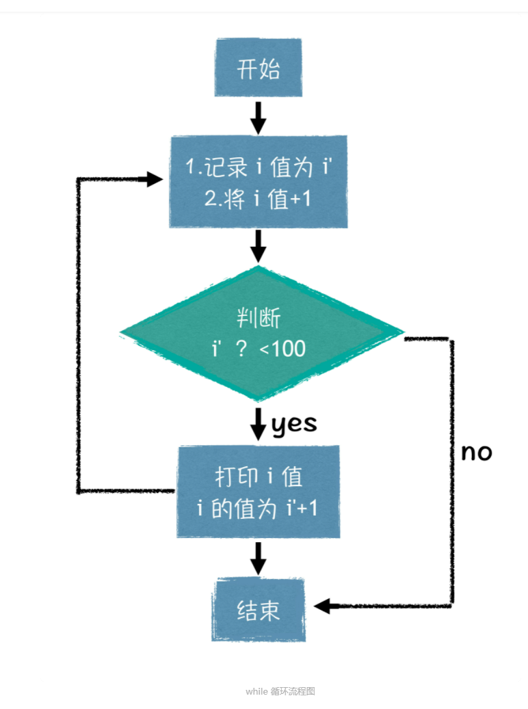

先来看看今天这 10 分钟我们要完成的任务。日期这个概念你肯定不陌生，生日对你我来说都很重要，如果你身边有 2 月 29 号过生日的小伙伴，恐怕最少 4 年，才能为他 / 她办一次生日宴。今天我们的这个任务，就和日期有关系。如果我给你一个由年月日组成的日期，再给你一个数字 X，你能否准确地让程序输出 X 天后的日期呢？

例如下面这个数据：

```js
1989 11 20 
20 
1989 12 10
```

数据中给出了 1989 年 11 月 20 日这个日期，然后问你 20 天后的日期是多少，你的程序应该输出 1989 年 12 月 10 日。特别需要注意的是，在这个任务中，你需要考虑到闰年中2 月份的特殊性，闰年的 2 月有 29 天。今天我们就学习，如何用计算机解决这类任务吧。

根据对任务的理解，我们可以分成两步来思考这个问题：

第一步：我们来思考如何求解 1 天后的日期，在求解 1 天后日期的过程中，我们涉及到的核心问题就是判断日子是否跨月，月份是否跨年，即判断；

第二步：是要让计算机重复 X 次 1 天后日期的计算过程，即重复循环做这件事。

要解决这两个难题，我们需要讲讲 C 语言中的一些基础知识，其中包括了程序中用于**逻辑分支判断的分支结构**，以及可以**重复做大量事情的循环结构**。听着这些专业词汇，。

#### **1.** 添加判断能力：“if…else”语法结构

简单来说，if 和 else 都是关键字，代表分支逻辑中的 “如果”和 “否则”。if 后面跟着的括号里面，需要放一个条件表达式，条件表达式如果成立，程序会执行 “语句 1”，否则就会执行 “语句 2”。下面我来举个例子，你就明白了：

```c
#include <stdio.h> 

int main() { 
	int a, b; 
	scanf("%d%d", &a, &b); 
	if (a == b) printf("a is equal to b!\n"); 
	else printf("a is not equal to b!\n"); 
	return 0; 
}
```

这段程序中，首先定义了两个变量 a 和 b，然后通过输入函数（scanf）给变量 a、b 赋值。之后就是重点部分了，根据我们上面所说的，如果 if 后面的条件表达式成立，那么就会输出 “a is equal to b!\n”， 否则就会输出 “a is not equal to b!\n”。

最后，我就再带你理解两个概念，一是条件表达式是什么，二是怎样理解 if 后面跟一条语句，所谓一条语句的概念范围是什么。

回到上面的程序中，你会看到程序中的 if 后面跟着一个括号，括号里面放着一个表达式，这个就是我们所谓的条件表达式，而这个括号，是必不可少的。我们发现，这个条件表达式用**两个等号**连接 a 和 b，作用是判断 a 和 b 里面存储的值是否相等。可千万别跟赋值表达式的**一个等号**弄混了。说到这里，我要告诉你一个重要的事实，变量有变量对应的值，表达式也有表达式对应的值。那么例如上面代码中的条件表达式“a == b”所对应的值是什么呢？其实就是数字 1或者 0，分别表示“条件成立”（a 与 b 的值相等）和“不成立”（a 与 b 的值不相等）。

##### 1.2.延伸内容：

那么除了条件判等以外，还有哪些条件运算符呢？有判断不等于的“a != b”，大于的“a > b”，小于的 “a < b”，大于等于的 “a >= b”，小于等于的 “a <= b”，逻

辑非 “!(a > b)”，等价于 “a <= b”。同时多个条件表达式，还可以用逻辑 && 和 ||进行连接，这个后面我再跟你细说。

事实上，if 的括号里面，不仅可以放条件表达式，类似于 “a - b”这种的表达式，也是可以当做 if 的条件的。

当一般表达式作为条件的时候，if 是怎么执行的呢？很简单，记住：**表达式的值，非 0 即为真**。例如，下面两行代码，效果等价：

```c
if (a != b) printf("a is not equal to b!\n"); 
if (a - b) printf("a is not equal to b!\n");
```

你会看到，第二行代码中，用 “a - b”代替 “a != b”，取得了同样的程序运行效果。因此，你只需要重点思考，表达式 “a - b” 什么时候结果非 0 即可，是不是当且仅当 “a!= b”时，“a - b”的结果非 0，根据之前所说的非 0 即为真，那么 if 条件也就算是成立了。

最后，我们来讲一下怎么理解“**if 后面跟一条语句**”这个概念，其实指的是 if 后面的条件成立时所执行的代码。这里，我们的重点是要理解一条语句都包含什么形式，大致可以分为如下几类。

**第一种，空语句**，就是什么都没有，单纯以一个分号结尾，例如下面这行代码，即使条件成立，也不会有任何实质上的操作。

```c
if (a == 3) ;
```

**第二种，单一语句**，比空语句多了语句内容，以分号结尾，例如下面这行代码，当条件成立的时候，会输出 “hello geek!”。

```c
if (a == 3) printf("hello geek!\n");
```

**第三种，复合语句**，被大括号包裹，中间是若干条语句，例如下面这段代码：

```c
if (a == 3) {
	printf("hello geek1!\n");
	printf("hello geek2!\n");
	printf("hello geek3!\n");
}
```

当条件成立以后，程序会依次执行大括号里面的三条语句

**第四种，结构语句**，以 if，for，while 等开头的分支语句或循环语句，例如下面这段代码，首先会先判断 a==3，如果条件成立，才会执行下面第二条 if 分支语句，当第二条 if 分支语句的条件也成立的时候，才会输出 “hello geek!”。

```c
if (a == 3) 
	if (b == 4) {
		rintf("hello geek!\n");
	}
}
```

由此可以看到，if 后面所谓跟着的一条语句，还真是丰富多彩，你可以在后面跟上像上面代码中所写的 printf 函数调用的单一语句，也可以用一个大括号，里面放上若干条语句，亦或是 if 后面跟着另一个 if 也是可以的！

至此，你就已经掌握了基础的将 “如果……就……否则……”这种逻辑结构转换成代码的能力了。你的计算机，终于有了“判断力”。

#### **2.** 给程序添加重复执行功能：for 和 while语句

下面呢，我们就用最简单的形式，利用 while 循环，输出前 100 个正整数：

```c
int i = 0; 
while (i++ < 100) printf("%d\n", i);
let i=0;
while(i++ < 100){
    console.log(i)
}
```

这段代码里面，出现了一个你之前没有见过的语法，就是 i++，这也是表达式，这个表达式的值等于 i 之前的值，当这条表达式执行完以后，i 会变成 i + 1 的值。例如，起初 i =2，i++ 表达式的值就等于 2，可表达式执行以后，你要是输出 i 的值，这时 i 实际等于3。**上面代码中，我们是用 i++ 表达式的值和 100 进行比较，表达式的值会遍历 0 到 99 所有的值，由于 printf 在 i++ 之后输出 i 的值，所以实际上每次输出的都是 i + 1 之后的值，**

也就是说 printf 会输出 1～100 所有值。具体的你可以参考下面的这个程序流程图。while 循环流程图另外，顺便再问你个问题，你还记得上一节课里，我们学到的\n 和 %d 分别代表什么意思嘛？如果不记得，记得回去再复习下。



while 循环语句的加持之后，重复做某件事，变得很方便。不急，下面我要给你介绍的是功能更为强大的 for 语句。还是先来看一下 for 语句的结构吧：

如果要是用 for 循环输出 1～100 所有值，会显得代码更清晰一些：

```c
for (int i = 1; i <= 100; i++) printf("%d\n", i);
```

上面这段代码，就是用 for 循环实现了和之前 while 循环相同的功能。

看了 for 循环和 while 循环以后，你可能会问，实际中哪种循环用的比较多，我个人经验来说，for 循环用的比较多，因为 for 循环每一部分都非常明确，对于比较复杂的循环控制过程，for 循环写出来以后，一般都会比 while 循环可读性强。

为了让你感受到 for 循环真正的威力，写一段代码，让你感受一下：

```c
for (int i = 1, k = 0; i <= 48; i++, k += 2) printf("%d\n", k);
```

上面这段程序中，我们用到了两个同步信息变量，i 和 k，i 从 1 到 48，保证循环了 48次；代码中“k+=2”表示 k 每次增加 2 ，也就是说，在这个过程中，i 遍历了 1 到 48 这48 个整型值，而 k 同步地遍历了从 0 开始的前 48 个偶数。这段代码的意思其实就是打印出从 0 开始后的共 48 个偶数，即 0、2、4……92、94。

如果用 while 来实现这个目的，知道怎么写吗？你可以自己在计算机上试一下。

#### 3.思考题：

##### 3.1打印乘法表

使用循环和条件判断，打印一个格式优美的 66 乘法表

要求 1：输出内容及样式参照下面给出的样例

要求 2：每两列之间用 \t 字符进行分隔，行尾无多余 \t 字符

```js
1*1=1 
1*2=2 2*2=4 
1*3=3 2*3=6 3*3=9 
1*4=4 2*4=8 3*4=12 4*4=16 
1*5=5 2*5=10 3*5=15 4*5=20 5*5=25 
1*6=6 2*6=12 3*6=18 4*6=24 5*6=30 6*6=36 
```

##### 3.2日期计算器程序完成

准备完了所有的基础技能后，就让我们来完成开始说的那个任务吧，我们来思考一下哈，首先我们需要有一个循环，循环每一次，让计算机帮我们计算一次下一天的日期。每次在计算下一天日期的过程中，先让日子加 1，判断是否跨月，如果跨过了一个月份，就让日子从 1开始，让月份加 1，再判断是否跨年，如果跨年了，就让月份从 1 开始，年份加 1。

如上的过程中，有一个关键问题需要你注意，就是 2 月份的月份天数的计算方法，咱们来简单回顾一下闰年的规则，年份满足以下其中一条即为闰年：

* 能被 4 整除，但不能被 100 整除；

* 能被 400 整除。


如果把闰年的规则翻译成逻辑判断，应该是下面这个样子：下面就让我们把思路过程转换成程序过程：

上面这段程序是个半成品，只处理了前 6 个月的情况，并且用到了 **switch…case 的分支结构**，与 if 结构类似，都是用于做逻辑分支判断的。关于这部分的内容，给你留个小作业，自学一下 switch…case 分支结构，然后按照自己的理解，补全上述程序，使得上述程序可以处理一年中 12 个月的全部情况。

```c
if ((year % 4 == 0 && year % 100 != 0) || year % 400 == 0) ... 
```

```c
#include <stdio.h> 

int main() { 
	int y, m, d, X; // 定义存储 年月日 和 X 的变量
	scanf("%d%d%d", &y, &m, &d); // 读入年月日
	scanf("%d", &X); // 读入 X 值 
	for (int i = 0; i < X; i++) { // 循环 X 次，每次向后推一天
		d += 1; 
		switch (m) { 
			case 1: 
			case 3: 
			case 5: { // 第一部分逻辑
				if (d > 31) d = 1, m += 1; 
				if (m == 13) m = 1, y += 1; 
			}; break; 
			case 4: 
			case 6: { // 第二部分逻辑
				if (d > 30) d = 1, m += 1; 
			} break; 
			case 2: { // 第三部分逻辑
				if ((y % 4 == 0 && y % 100 != 0) || y % 400 == 0) { 
					if (d > 29) d = 1, m += 1; 
					} else if (d > 28) { 
						d = 1, m += 1; 
					} 
				} break; 
			} 
	}
	printf("%d %d %d\n", y, m, d); 
	return 0; 
}
```

虽然这个程序中有一部分内容需要你进行自学，可你也不要担心，我还是会跟你详细解释上述程序设计的思路。读入部分的代码，相信你现在已经可以很好的掌握了，这一部分就不展开解释了。程序整体设计中，是用 for 循环包裹了 switch…case 结构，for 循环负责循环X 次，每次在循环内部，都将对日子变量 d 进行加 1 操作，而在 switch…case 结构内部，主要是处理跨月和跨年的问题。你会看到 switch…case 结构中，

主要分成三部分逻辑，

第一部分逻辑，主要处理天数为 31天的月份，由于 12 月也是 31 天，所以当本月是 12 月，并且发生了跨月，变成了 13月，说明是到了下一年的 1 月，需要将年份 +1，月份置为 1 月。

第二部分逻辑，主要处理天数为 30 天的月份。

第三部分逻辑，主要处理 2 月份的情况，在这里，程序中分成两种情况来讨论，闰年和非闰年，闰年的时候，判断日子是否超过 29 天，非闰年，判断日子是否超过 28 天。

我保证，在你尝试补全上述程序的过程中，你会发现，上述程序易于修改和补全，你要是能试着将上述程序修改成 if 分支结构，那就更好了。这样你将对上述程序结构的美，会感受的更深刻。

#### 4.课程小结

最后呢，来总结一下今天所学的重点。今天呢，我们主要学习了两种程序流程控制结构，一种分支结构，主要以 if 语句为代表，另一种循环结构，以 for 循环和 while 循环为代表。

如果说你只想记住几点的话，那么应该是以下几点：

1. 熟练掌握分支和循环结构的执行顺序，这一点很重要。

2. if 语句，首先判断条件表达式的真假，如果为真，则执行 if 里面的语句。

3. for 循环，分成四部分，其中②④③部分，构成了一个循环，第①部分是用做初始化的。

4. 所谓一条语句的概念，包括了空语句，单一语句，复合语句和结构语句。

以上这 4 点要牢记哦，尤其是其中的分支和循环结构的执行顺序，因为掌握和理解了程序的执行顺序，才是分析程序，理解程序的第一步。

好了，今天就到这里了，下期我将带你来做一个小总结，我将带你学习一个有趣的圆周率的计算方法.

```c
#include <stdio.h>

/*
 * 给定一个日期, 和一个数字X, 求出X天后的日期是什么
 * 实例:
 *     1989 11 20
 *     20
 *     1989 12 10
 */


int main ()
{

	int year, month, day;
	int X;
	int flag = 1;

	printf("please enther the start day in format year month day: \n");
	scanf("%d %d %d", &year, &month, &day);
	// 检查输入是否符合规范
	while (flag){	
		switch (month){
			case 1:
			case 3:
			case 5:
			case 7:
			case 8:
			case 10:
			case 12:
				if (day > 31){
					printf("illegal format!\n");
					printf("please enther the start day in format year month day: \n");
					scanf("%d %d %d", &year, &month, &day);
					break;
				} else {
					flag = 0;
					break;
				}
			case 4:
			case 6:
			case 9:
			case 11:
				if (day > 30){
					printf("illegal format!\n");
					printf("please enther the start day in format year month day: \n");
					scanf("%d %d %d", &year, &month, &day);
					break;
				} else {
					flag = 0;
					break;
				}
				//能被400整除 x % 400 = 0
				//能被4整除，但不能被100整除 x % 4 = 0, x %100 !=0
			case 2:
				if ( (year % 400 == 0) || (year % 4 == 0 && year % 100 !=0) ){
					if (day > 29){
						printf("illegal format!\n");
						printf("please enther the start day in format year month day: \n");
						scanf("%d %d %d", &year, &month, &day);
						break;
					} else {
						flag = 0;
						break;
					}
				} else {
					if (day > 28){
						printf("illegal format!\n");
						printf("please enther the start day in format year month day: \n");
						scanf("%d %d %d", &year, &month, &day);
						break;
					} else {
						flag = 0;
						break;
					}
				} 
			default :
				printf("illegal format!\n");
				printf("please enther the start day in format year month day: \n");
				scanf("%d %d %d", &year, &month, &day);
				break;
		}
	}
	printf("Start day: %d-%d-%d\n", year, month, day);
	printf("How many days passed?\n");
	scanf("%d", &X);

	// 每次循环的时候减少日期
	// 后缀--表示，先返回X和0进行比较
	// 然后让X自减1
	while ( X-- > 0){
		day = day + 1;
		/* 根据月份进行判断, 是否日期超过了每个月的日期数
		   如果超过了, 则月份增加, 然后日期回归到1日
		   同时，如果月份增加，则需要判断是否超过了12
		   如果超过了12，那么年份增加
		   */
		switch (month){
			case 1:
			case 3:
			case 5:
			case 7:
			case 8:
			case 10:
				if (day > 31){
					month++;
					day = 1;
					break;
				} else{
					break;
				}
			case 12:
				if (day > 31){
					month = 1;
					day = 1;
					year++ ; 
					break;
				} else{
					break;
				}
			case 4:
			case 6:
			case 9:
			case 11:
				if (day > 30){
					month++;
					day = 1;
					break;
				} else{
					break;
				}
				//能被400整除 x % 400 = 0
				//能被4整除，但不能被100整除 x % 4 = 0, x %100 !=0
			case 2:
				if ( (year % 400 == 0) | (year % 4 == 0 & year % 100 !=0) ){
					if (day > 29){
						month++;
						day = 1;
						break;
					} else{
						break;
					}
				} else {
					if (day > 28){
						month++;
						day = 1;
						break;
					} else{
						break;
					}
				} 
		}
	}

	printf("End day: %d-%d-%d\n", year, month, day);
}
```

