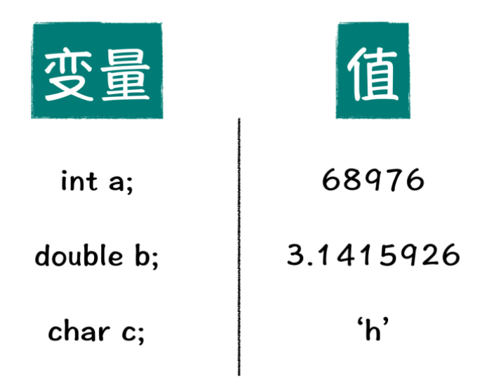

掌握一种数据处理技巧，本质上是在上述几种数据类型之间做转换，从而使你对 scanf 函数和 printf 函数的理解更加深刻。

今天呢，我将给你介绍一种特殊的数组：字符数组，一种用来存储字符串信息的数组。来，跟我一起看看到底是怎么回事吧！

首先，先让我们来看一下今天的任务。你还记得 printf 函数如何输出浮点型吧，那下面请你回忆一下，printf 函数在输出浮点型数据的时候，如何保留位数呢？下面的代码，演示了如何保留小数点后两位：

```c
1 printf("%.2lf", 3.1415926);
```

%lf 是 double 双精度浮点型输出的格式占位符，当我们想要保留小数点后两位的时候，只需要在 % 和 lf 中间加上 .2 即可。

有了上面这个基础，现在我让你保留小数点后 2 位、3 位、4 位。对你来说肯定都不是什么难题了。先不要高兴太早，今天我们的任务是，实现一个能够保留小数点后 n 位的程序，这里的 n 是我们程序读入的一个变量。例如，面对如下输入：

```c
3.1415926 2 
3.14
```

第 1 行有两个数字 3.1415926 和 2，第一个浮点数代表要进行保留位数输出的浮点值，第二个整型代表具体要保留 2 位小数，你的程序应该能够正确的输出 3.14。那么类似的，当程序输入 3.1415926 和 3 的时候，你的程序应该输出 3.142。

面对这样一个任务，你想怎样进行实现呢？下面就给你一个设计不太优美的程序示例：

```c
#include <stdio.h> 

int main() { 
	double num; 
	int n; 
	scanf("%lf%d", &num, &n); 
	switch (n) { 
		case 1: printf("%.1lf\n", num); break; 
		case 2: printf("%.2lf\n", num); break; 
		case 3: printf("%.3lf\n", num); break; 
		case 4: printf("%.4lf\n", num); break;
         case 5: printf("%.5lf\n", num); break;
    }
    return 0;
}
```

你会看到，在这段程序中，使用 switch…case 结构将 n 等于 1、2、3、4、5 时候所对应的程序输出行为都罗列了出来，看似好像解决了问题，可实际不然。当 n 等于 6、7、8、9、10 怎么办呢？就让我们通过今天的学习，来尝试解决这个问题吧。

你先来好好看看上面给出的那个设计的很丑的示例代码，case 结构中的 5 行代码，除了 printf 中的格式控制字符串不同以外，其余代码均相同，是不是稍稍感觉这里有些可操作的空间呢？

#### **1.** 值和变量

我们先来重新认识一下两个概念，就是“变量”和“值”的概念。“变量”你肯定不陌生，之前的课程中我们一直在说，例如：整型变量，浮点型变量。

所谓整型变量，就是存储整型的变量。这么解释呢，好像又啥都没说，可这句话本来就带有不说自明的效果。根据名字理解，就是可以变化的量，就像我在代码中定义了一个整型变量 a，然后通过读入给 a 赋值，我问你，a 等于多少，你只能回答不知道，因为这个 a 变量的值是可以变化的。

看完了变量这个概念以后，那什么又是“值”呢，也很简单，就是存储在变量中的内容，就是值。整型变量存储整型值，浮点型变量存储浮点型值。比如说，数字 3 就是整型值，如果我们为了后续计算想存储这个整型值，就需要放到一个整型变量中。

所以总得来说，具体结果就是值，明确知道等于多少的就是值。存储这些值的地方，就是变量，就是在程序中用来指代某片存储空间的名称，值就是存储空间里面的具体内容。如下图所示：



#### **2.** 字符串和字符数组

为什么要明确什么是“值”什么是“变量”呢，因为我想让这两个概念在你的脑子中产生具象化的效果，一说到“值”，你就知道，是存储在“变量”中的内容，某一种类型的值，存储在某一种类型的变量中。下面将要讲解的这两个概念，就是“值”和“变量”概念的衍生品，它们是“字符串”与“字符数组”。

**“字符串”就是“值”，而“字符数组”就是存储字符串数据的空间，类比于“变量”的概念。**

如果说 1、2、3、4、5 这种整型“值”，你可能很容易理解，因为在你之前的学习中就接触过。那么什么是字符串值呢? 先看一下字符串值的形式：


如上图所示，是一个 “hello world” 内容的字符串数据，字符串数据被一对双引号包裹，中间是字符串内容。像我们看到的上面字符串内容中的 h 啊，e 啊，l 啊，这些就是所谓的“字符”，那么多个字符写成一串，故名“字符串”。为了加以区分，字符内容是用单引号，字符串内容是用双引号。

之前我们学过，一个字符占一个字节的空间，那么这个 “hello world” 字符串内容占多少个存储空间呢？hello 有五个字符，world 有五个字符，是 10 个字符么？不对。别忘了中间还有一个空格字符呢，虽然不可见，可你看得出来它对内容的影响。

那么加在一起一共是 11 个字符么？也不对，这个字符串数据中，还有一个彻底看不见影响，可对于底层来说很重要的字符，我们管它称作“杠零字符”，写作 \0。每次读这个，都让我想起健身房里面的杠铃。

那么这段字符串实际在内存中存储的结果，应该如图中所示：


你可以看到，“hello world” 字符串中的每一个字符会占用一个字节存储单元，结尾还有一个 \0 字符，这个 \0 字符是标记字符串结束的。也就是，我们的程序在看到这个字符串的时候，会从第一个字符开始，直到碰到 \0 字符为止，这中间的内容就是字符串的内容。

这里我们要强调两个概念“字符串长度”和“字符串占用空间”，这是两个相似但不同的概念。字符串长度，就是字符串内容所占字节数量，例如示意图中“hello world”这个字符串内容，长度是 11。

而如果要说这个字符串所占用的空间大小，那就别忘了，还有一个 \0 字符需要额外占用 1位呢。所以如果说到“字符串占用空间”是多少的话，应该是 12。

看完了字符串的基本概念以后，字符数组的概念就容易理解得多了，就是用来存放字符串的变量空间。从名字上面看的话，字符数组本质上是个数组，但这个数组的每一个元素类型不再是我们之前说到的整数类型，而是变成了字符型，也就是之前所提到的 char 类型。

那么如果想要存储示意图中的字符串，我们需要定义一个多大的数组呢？你稍加思索，就应该知道，最少要定义一个长度为 12 的数组。

```c
char str[12] = "hello world"; 
printf("%s", str);  // hello world
```

就如上面这段代码所示，定义了一个长度为 12 的字符数组，然后将字符串 “hello world” 存储到这个空间中。注意，这种给字符数组赋值的方法，只能出现在字符数组定义时这样使用，非定义语句中，不能这样给字符数组赋值，会得到一个编译器给的错误提示。然后在第 2 行代码中，我们通过 printf 函数，输出字符数组中的信息，其中 %s 是字符串数据的格式占位符。最终你会在你的电脑上得到一行 hello world 的输出。

**3.** **字符串操作的利器**

如何操作字符串信息。说到操作，你来回忆一下整型数据支持的操作都有什么？能想到的最简单的是不是就是：加、减、乘、除和取余运算。

所谓操作，更准确地说是“运算”，就是使用现有值，产生新值的一个过程。上面我们明确了字符串数据就是一种值，那么这种值又支持哪些操作呢？很多资料上面会讲解一些函数方法，例如：求字符串长度的 strlen 函数，拷贝字符串的strcpy 函数，比较字符串的 strcmp 函数，连接两个字符串的 strcat 函数。因为这些函数

方法较为简单，我打算把这些函数方法的学习作为你的自学作业，请你自学 string.h 头文件中的相关函数使用。

除此之外，今天我打算给你介绍两个更加灵活且强大的字符串操作函数：**sscanf 函数**和**sprintf 函数**。

从名字上面来看，除了名称前面加了一个 s 以外，剩下的部分，就是 scanf 和 printf，前面这个 s 其实指代的是 string，也就是字符串。正常来说，与 scanf 和 printf 进行信息交互的场所就是你运行 C 语言程序时候所看到的那个黑色框框，而与 sscanf 和 sprintf 进行信息交互的场所则是字符数组。你读这句话可能有点懵，听我继续往下讲。

下面让我们看一个 sscanf 的简单例子：

```c
char str[20] = "123.45"; 
double num; 
sscanf(str, "%lf", &num);
```

在这个例子中，第 1 行是一个字符数组 str，其中的字符串信息是 “123.45”，第 2 行定义了一个浮点型的变量，第 3 行代码是重点，它使用 sscanf 从 str 所存储的字符串中读入一个浮点型数据，然后赋值给 num 变量，这里比传统的 scanf 函数多了一个参数，这个参数代表读取数据的字符串信息。

上面例子中展示了**如何将一个字符串转换成一个浮点型数据**，即把原始字符串的“123.45”转换成了浮点型数据“123.45”。那么你也可以自行设想将字符串转换成整型数据等等。其实 sscanf 就是提供了一种将字符串信息转换成其他信息的方式。

看完 sscanf 以后，下面看 sprintf 就简单多了，sprintf 也是比传统的 printf 函数多了一个参数，请看下面的这个使用 sprintf 输出 “hello world” 字符串的例子：

```c
char str[100]; 
sprintf(str, "hello world");
printf("%s", str);
```

例子代码中分成 3 行，第 1 行定义了一个字符数组 str，第 2 行调用 sprintf 函数，相比于printf 函数，多了第一项的参数，代表将原本输出到标准输出流中的内容，输出到 str 数组中。所谓标准输出流是一种专业的叫法，现在你可以简单的认为，就是你所认识的那个黑框框。

在这个例子中，也就是将 “hello world” 字符串，输出到了 str 字符数组中，也就是完成了一个字符数组赋值的过程。最后一行，使用 printf 函数，打印 str 数组的值，你会在屏幕上看到 “hello world” 字符串。

通过上面这个例子，你可以清楚的看到，sprintf 函数就是将原本 printf 函数输出的内容，输出到一个字符数组中存储起来，以方便在程序中的后续操作和使用。

sscanf 函数与 sprintf 函数对比着看的话，如果说 sscanf 是将字符串转换成整型、浮点型等其他类型的方法，那么 sprintf 就是将其他类型转换成字符串类型的方法。

#### 思考题

##### 体验利器

刚刚在上面，介绍了 sprintf 和 sscanf 两个字符串处理的利器工具，那么就请使用sprintf 函数实现 strlen、strcpy、strcat 函数的功能，注意哦，只允许使用 sprintf 函数，模仿如上三个函数的功能。

##### 优美的遍历技巧

介绍完了字符串的相关知识以后，请思考如下问题，如何在不计算字符串长度的情况下，遍历字符串的每一位呢？

程序设计要求是，读入一个字符串，然后在不计算字符串长度的情况下，输出字符串中的每一个字符，每个字符占一行。其中所谓计算字符串长度的方法，包括但不限于strlen，sprintf，先行 for 循环遍历统计等。

##### 实现保留任意小数

最后，让我们回到今天的任务，实现保留任意位小数输出的功能。请你注意观察，printf 函数的第一个参数，究竟是个什么？你会恍然大悟，printf 函数的第一个参数不就是个字符串，既然是字符串信息，那我只需要在 printf 语言前，拼接合适的字符串信息传给 printf函数即可。

例如，要求保留 1 位小数的时候，我就拼接出来 “%.1lf” 字符串信息，要求保留 2 位小数的时候，就拼接处理出 “%.2lf”字符串信息即可。

```c
#include <stdio.h> 
int main() { 
	double num; 
	int n; 
	char str[100]; 
	scanf("%lf%d", &num, &n); 
	sprintf(str, "%%.%dlf\n", n); // %% 代表输出一个 % 
	printf(str, num); 
	return 0; 
}
```

程序主函数的第 3～5 行，分别定义了一个浮点型变量 num，一个整型变量 n 和 一个字符数组 str。接下来我们就要依据 n 的信息，利用 sprintf 函数把构造出来的格式控制字符串信息输出到 str 字符数组中。

这里需要注意的是第 7 行的两个百分号 （%%），它代表输出的时候，输出一个百分号，这是为了与格式占位符的 % 相兼容。试想一下，如果不这样规定，当你格式控制字符串是“%d” 的时候，就会出现歧义，一方面可以解释成为是输出一个 % 和一个 d 字符，另一方面可以代表十进制整型的格式占位符。

以防出现这种歧义，当我们想输出一个百分号的时候，需要在格式控制字符串里面，打上两个百分号，以示区分。最后我们把字符数组 str 当成原来的格式控制字符串传给 printf 函数，这样，就将文章开始时，代码中的 printf 函数的第一个参数，从定值字符串信息，替换成了变量字符数组 str中所存储的信息。

通过今天这个任务，你应该可以看到，拥有变量的程序，会使得我们的程序更具一般性和通用性。

其实变量代表了问题中可以被抽象化出来的量，就像以前，我们刻板的认为 printf 的第一个参数只能是一个显示的字符串信息，通过今天的学习，我们才彻底明白，printf 第一个参数，无非就是需要一个字符串的值，所以我们不仅仅可以传递给 printf 函数一个字符串的值，更可以传递给它一个字符数组，这样会使得整个程序功能更加灵活。

```c
#include <stdio.h>                                  
/* 题目                                             
 * 输入一个小数和保留位数                           
 * 输出保留后的小数                                 
 */                                                 

/* 知识点:
 * 1. 格式输入中, 为了表示一个%, 需要用%%
 * 2. sprintf: 将原本输出到屏幕的内容，保存到变量中
 * 3. sscanf: 将原本从屏幕接受的字符串输入，从字符串数组中读取
 * 4. 字符串数组需要以'\0'表示字符串的结束
 */


int main(int argc, char *argv[])                                          
{                                                   
    // how many digit to keep                       
    int n;                                          
    // input number                                 
    double num;                                     
                                                    
    // character array to store input               
    char str[100];                                  
                                                    
    printf("Please enter your number: ");           
    scanf("%lf", &num);                             
    printf("How many digits do you want to keep: ");
    scanf("%d", &n);                                
                                                    
    // format the str to num                        
    sprintf(str,"%%.%dlf\n", n);                    
    printf(str, num);                               
}               
```

#### 课程小结

通过今天对于字符串内容的学习，我们更加明确了“值”和“变量”的概念，这个概念，在后面学习指针相关知识的时候是非常重要的，所以你可千万不要忽视了今天我们花大量篇幅解释的这两个看似显然的概念。记住“值”和“变量”是两个概念，“变量”是存储“值”的地方。

1. 字符串信息可以存储在字符数组中，字符数组就是“变量”的概念，字符串就是“值”的概念

2. sscanf 和 sprintf 函数，本质上在做的是以字符串为中间值，做各种数据类型之间的转换。