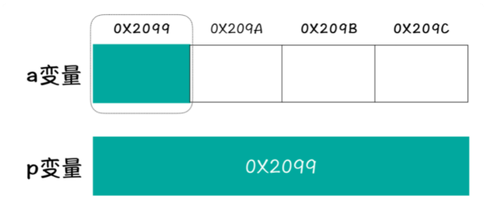

对两个概念做了区分，就是“值”和“变量”。你也看到了，当我们将 printf 函数中的第一个参数，抽象成变量以后，整个程序的功能会变得异常的灵活。

今天我们将要学习的 “指针”呢，也是一种变量，这是一种存储地址的变量。这种变量，可谓是所有变量的终极形态，掌握了指针，也就掌握了程序设计中“变量”的全部知识。今天，我们只会围绕着一句话进行学习，一定要记住，那就是 “指针变量也是变量”。

假设有如下结构体数组，请看如下代码：

```c
struct Data { 
	int x, y; 
} a[2];
```

请用尽可能多的形式，替换下面代码中 &a[1].x 的部分，使得代码效果不变：

```c
struct Data *p = a; 
printf("%p", &a[1].x);
```

你会看到，如上代码中，其实就是输出 a[1].x 的地址值。

到了这里，你可能对结构体还不熟悉，并且，你可能对于这个任务应该如何完成还是一头雾水，没关系，暂时忘了这个任务，我们先来讲讲可以解决任务的一些基础知识，再回来看这个任务。

进行下面的学习之前，我还是要强调一下那句话，这句话是我们这两次学习的重点，也是帮助你学习指针的利器，叫做“**指针变量也是变量**”。

#### 1.初识：结构体

为了完成今天的任务，你先要学习一些关于结构体的知识。先来想一个这样的问题：想要在程序中输入 n 个整数的话，我们知道可以用整型数组来进行存储，可是如果想要是输入 n个点的坐标信息呢？用什么类型的数组来存储呢？是使用坐标类型的数组来存储么？没错！

你可能会疑问了，坐标类型怎么表示呢？其实这个坐标类型，可不像整型一样，整型是程序语言中给我准备好的现成的类型，而这个所谓的坐标类型，虽然程序语言中没有，但我们**可以通过 C 语言里面的工具来描述这种类型的特点，这个可以用来描述和定义新类型的工具，就叫做：结构体**。

下面我们看看如何用结构体定义一个新的数据类型，名字就叫做 point 类型吧：

```c
struct point { 
	// 描述这个类型的组成部分
};
```

上面在这行代码中，我们定义了一个新类型，是 struct point，也就是结构体点类。我这里强调一下，这个新类型不是 point，在 C 语言中，这个新类型是 struct point。struct 是关键字，代表结构体，point 是为了与其它结构体定义的类型相区分，后面的大括号内部是用来描述这个新类型的组成部分的。

有了这个类型以后，你就可以写如下的代码，来定义点类型的变量了：

```c
struct point p1, p2;
```

正如你看到的，我们定义了两个点类型的变量，p1 和 p2，可由于上面我们没有具体描述点类型的组成部分，所以这个 p1 和 p2 变量只是名义上的点类型变量，却没有什么实质性的作用。

什么叫做“具体描述点类型的组成部分”呢？来让我们想想，我们如何表示一个坐标点，在数学中，一般情况是用一个二元组 (x, y) 表示一个点坐标。假设，在我们的问题场景中，点坐标都是整型的话，那么程序中的点类，就应该是由一对基础的整型变量组成的，具体写成代码如下所示：

```c
struct point { 
	int x, y; 
};
```

正如你所看到的，我们在原本的结构体点类的大括号中，加入了两个整型字段，具体的语义含义是，一个点类型数据其实可以具体的表示成为两个整型数据。在这个过程中，有没有一种盖房子的感觉？先有地基，再盖一楼，然后是二楼。也就是在程序中，先有基础数据类型，然后是基于这些基础数据类型，定义出新的数据类型。

你也可以想象，我们其实可以用我们定义出来的新类型，去定义另一个新的类型。而所谓C 语言中的基础数据类型，就是程序语言给我们准备好了的地基，而所谓程序的功能模块，就是别人盖好的房子，我们直接拿过来使用。就像之前我们了解的 printf 函数和 scanf 函数一样，都是 C 语言给我们准备好了的基础功能模块。

有了基础功能，我们可以开发更高级的功能，有了基础类型呢，我们也可以开发更复杂的类型。这个过程，将来你可以自己逐渐的加深体会，在这里，我就不过多的展开来说了。

描述了结构体点类型的具体组成部分以后，之前的 p1 和 p2 变量就具备了实际的功能了，下面，我们让 p1 代表点 (2, 3)，让 p2 代表点 (7, 9)，代码如下：

```c
p1.x = 2; 
p1.y = 3; 
p2.x = 7; 
p2.y = 9;
```

可以看到，我们可以给 p1 和 p2 变量中的 x，y 字段分别赋值。这里出现了一个新的运算符，就是点“.”运算符，这个也叫做“直接引用”运算符，p1.x，意思是 p1 变量里面的 x字段。后面讲解完指针内容以后，我们还会介绍间接引用运算符“->”，由一个减号和一个大于号组成，这个我们后面再说。

#### **2.** 结构体变量的大小

就像我们之前所说的，变量是存储值的地方，只要是变量，就一定占用若干存储单元，也就是占用若干字节的空间。结构体变量既然也是变量的话，那么一个结构体变量又占用多少个字节呢？

以我们刚才设置的结构体变量为例，这个包含两个整型字段的结构体类型变量，占多少个字节的存储空间呢？你可能会想，那还不简单，最起码要拥有足够放下两个 32 位整型数据的存储空间吧，因为其中包括了两个整型字段，所以一个 struct point 类型变量最起码应该占 8 个字节。如何验证你的想法呢？还记得之前讲过的 sizeof 方法吧？

```c
struct point p; 
sizeof(p); 
sizeof(struct point);
```

这两种使用 sizeof 方法的代码均能正确的告诉你一个 struct point 类型的变量占用的存储空间大小。你可能感觉自己已经掌握了计算结构体变量大小的诀窍。

先不要高兴太早，看下面这两个结构体的情况：


可以看到， Data1 和 Data2 两个结构体，都是由两个字符型字段和一个整型字段组成的。但这个对比中，存在两个你无法忽视的问题：

Data1 结构体，只包含一个整型和两个字符型字段，所占用的空间大小应该是4+1+1=6 个字节啊，怎么变成了 8 个字节？

Data2 结构体，和 Data1 结构体包含字段种类都是一样的，那既然 Data1 是 8 个字节，为什么 Data2 是 12 个字节呢？

先来看第一个问题，为什么 Data1 类型的变量占用的是 8 个字节，而不是 6 个字节呢？这里就要说到结构体变量申请存储空间的规则了。正如你知道的，像整型这种 C 语言原有的内建类型，都是占用若干个字节，整型变量的存储，就是以字节为单位的。而今天我们学到的结构体变量，需要占用若干个存储单元，结构体变量的存储，就是以存储单元为单位的，

那么一个存储单元占用多少个字节呢？记住，下面这个就是重点了：**对于某个结构体类型而言，其存储单元大小，等于它当中占用空间最大的基础类型所占用的字节数量。**

说白了，对于 Data1 结构体类型来说，整型是其当中占用空间最大的基础类型，它的一个存储单元的大小，就是 4 个字节，等于它当中整型字段所占用的字节数量。也就是说，Data1 这个结构体类型，要不就占用 1 个存储单元，即 4 个字节的空间，要不然就占用 2个存储单元，即 8 个字节的存储空间，不会出现 6 个字节的情况。

究竟占多少呢？按照最小存得下原则，Data1 最少应该占用 2 个存储单元，才能放下一个整型和两个字符型，这就是为什么 Data1 类型占用 8 个字节的原因。

你会问了，按照这个解释，那 Data2 为什么占用 12 个字节呢？Data2 中不也是一个整型和两个字符型么？先别着急，这就进入我要讲的第二个重点了：**结构体的字段在内存中存储的顺序，是按照结构体定义时的顺序排布的，而且当本存储单元不够安放的时候，就从下个存储单元的头部开始安放。**

这是什么意思呢？下面是我给你准备的一张 Data1 和 Data2 两个结构体类型的内存占用情


你可以看到，在 Data1 中，首先是 int 类型的 a 变量，占用了第一个存储单元，然后 b 和c 占用了第二个存储单元的前两个字节。

再看 Data2，由于 Data2 不同于 Data1 的字段顺序，b 占用了第一个存储单元的第一个字节，剩余的 3 个字节不够存放一个 int 类型变量的，所以按照上面我们讲的规则“当本存储单元不够安放的时候，就从下个存储单元的头部开始安放”， a 变量就单独占用了第二个存储单元，c 自己占用第三个存储单元的第一个字节。

所以，虽然在数据表示上，Data1 和 Data2 是等价的，可 Data2 却占用了更多的存储空间，相比于 Data1 造成了 50% 的空间浪费。由此可见，**在设计结构体的时候，不仅要设计新的结构体类型中所包含的数据字段，还需要关注各个字段之间的顺序排布**。

#### **3.** 指针变量也是变量

看完了结构体相关的知识以后，下面来让我们进入一个被很多初学者称为 C 语言中最难理解的的部分，指针相关知识的学习。面对这部分内容，我只希望你记住一句话：指针变量也是变量。

之前我们学习的“变量”和“值”的概念，我什么类型的值，就用什么类型的变量进行存储，整型变量，是存储整型值的东西，浮点型变量是存储浮点型的东西。

当你听到“指针变量也是变量”这句话的时候，我希望你能提出如下问题：既然指针变量也是变量，那指针变量是存储什么类型的值的呢？还记得我们之前讲的地址的概念吧，你会发现，所谓变量的地址，就像整数和字符串一样，其实是一个明确的值啊。

那对于地址，我们使用什么变量来进行存储呢？没错，**指针是变量，指针是一种用来存储地址的变量！**在这里我再强调一遍“指针变量也是变量”，这意味着，你之前对于“变量”这个概念的认识，都可以放到指针变量的理解上。

让我们先来看一下如何定义一个指针变量：

```c
int a = 123, *p = &a; 
printf("%d %p %d\n", a, p, *p);
```

在上面这段代码中，a 是一个整型变量，p 变量前面多了一个 *，这个 * 就是用来说明 p 是一个指针变量，是一个存储整型变量地址的指针变量，在代码中，你也可以看到，我们将 a的地址赋值给了 p 变量。

代码的第 2 行，共输出三项信息：第一项输出 a 中存储的整型值（第一个 %d 对应的是a)，第二项是输出 p 中存储的地址值（%p 对应的是 p)，第三项输出的是 *p 的值（第二个%d 对应的是 *p)，p 里面存储的是地址，*p 代表了 p 所指向的存储区内部的值。

为了更清楚的解释 *p，给你准备了下面的图，以便你理解 a 和 p 的关系：



从图中你可以看到，p 变量中存储的就是 a 变量的首地址，也就是说，我们可以通过 p 变量中所存储的信息，按图索骥，就能找到 a 变量所代表的存储区，进而操作那片存储区中的内容。 p 变量对于 a 变量的作用，是不是很像一个指路牌呢？指针的名称，也就由此而来。

我们再来看，如果 p 本身代表了 a 变量的地址，那么如何取到这个地址所对应的存储空间中的内容呢？这个就是 * 运算符，放到变量名前面，我们叫做“取值”运算符，对于 *p 的理解就是取值 p 所指向存储区的内容，也就是原有 a 变量中所存储的值。

一种更简单的理解方法是，在写程序的时候 *p 就是等价于 a，也就是说当你写如下代码的

```c
*p = 45;
```

实际上等价于写了一行代码 a = 45。也就是说，实际上是把 a 变量中存储的值给改变了。

#### 课程小结

在最后的这个例子中呢，聪明的你有没有注意到这样一个问题：a 变量实际上有 4 个地址，p 中存储的只不过是 a 变量的首地址，也就是说，p 中所存储的地址，只指向了一个字节的存储空间，那为什么当我们使用 *p 的时候，程序可以正确的对应到 4 个字节中的数据内容呢？

上面这个问题，就要涉及到指针的类型的作用了，下一篇文章我们再详细聊一下这个事情。

1. 结构体是用来创造新类型的利器，而结构体类型所占存储空间大小，与其内部字段的组成和各个字段的顺序排布均有关。

2. 指针变量也是变量，这是一种存储地址信息的变量。

