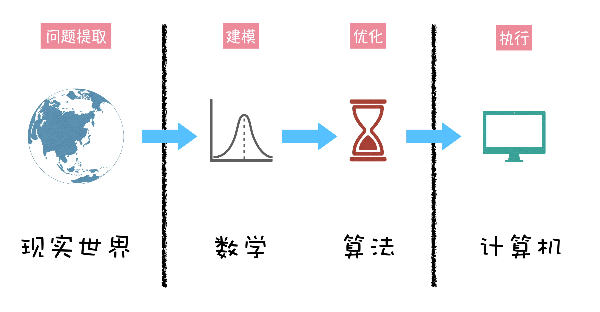
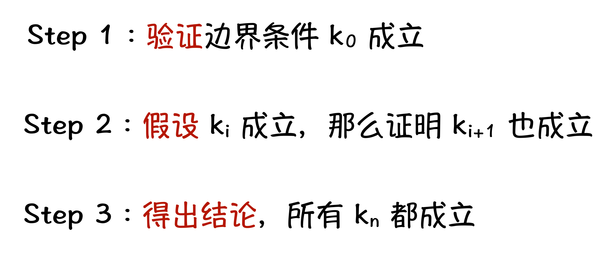
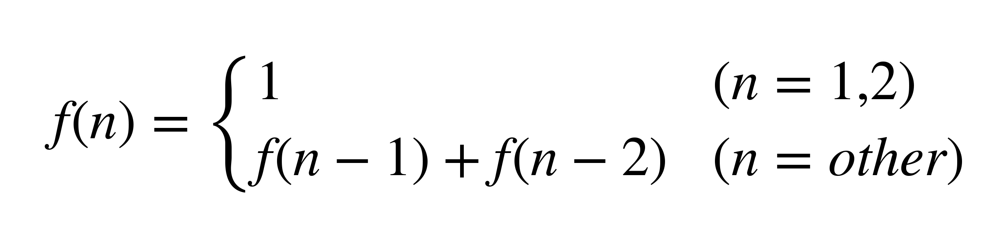

这里给你一个建议，在刚刚完成了语言基础篇的学习后，我希望你用心地体验“螺旋式上升”的学习过程。就是前面的基础篇虽然学完了，可并不是意味着，不需要再学习更多的语言相关的东西了，你可以做如下两件事情：

对于语言基础，你可以选择学习第二遍，当你站在第一遍的基础上，再回头看的时候，肯定会对之前的知识有更深的理解；

选择在其他参考资料中，继续学习语言中更多的知识点。你会发现，某些之前自己认为晦涩难懂的东西，可以自学搞明白了，这就是我提到的“螺旋式上升”的学习方法。

循环结构，你已经不陌生了，如下代码所示，是一个单层循环的程序，依次地输出从 1 到 n 的每一个数字，每个数字占一行：

```c
#include <stdio.h>

int main() {
    int n;
    scanf("%d", &n);
    for (int i = 1; i <= n; i++) {
        printf("%d\n", i);
    }
    return 0;
}
```

当我们输入 4 的时候，程序的输出结果如下所示：

```c
1
2
3
4
```

上面这个是单层循环的情况。下面这个例子，是一个双层循环的例子，每层循环都从 1 循环到 n，循环内部每次输出两个循环遍历的值：

```c
#include <stdio.h>

int main() {
    int n;
    scanf("%d", &n);
    for (int i = 1; i <= n; i++) {
        for (int j = 1; j <= n; j++) {
            printf("%d %d\n", i, j);
        }
    }
    return 0;
}
```

当我们输入 3 的时候，程序的输出结果如下所示：

```c
1 1
1 2
1 3
2 1
2 2
2 3
3 1
3 2
3 3
```

看了上面单层循环和双层循环的例子以后，如果让你改写成类似的三层循环的程序，想必这个你一定会做，无非就是在两层循环的内部，多加一层循环，然后 printf 输出的时候，输出的是三个变量的值即可。如果你可以自己理解到这个程序，那么你就可以理解今天这个任务。

今天这个任务，和上面的例子类似，但它不是实现一层循环的程序，也不是实现三层循环的程序，而是实现一个 k 层循环的程序。什么意思呢？就是 k 是一个读入参数，之后再读入一个参数 n，含义和上述程序中的 n 一致，而这个程序的输出结果，与上述例子中的输出结果类似，只不过每行输出 k 个数字。

理解了上面这个任务要做什么了，你可能还会发懵：为什么循环层数是可变的，代码结构不是确定性的么？别着急，今天我们将学习一个重要的编程技巧，那就是递归。

这里我要提醒一下，**递归是一种编程技巧**。你可能会在某些资料中，看到递归算法这种说法，其实这种说法是不合适的，因为明显的事实是，能够用循环实现的算法，都可以用递归这种编程技巧实现。如果递归算作算法，那你听过循环算法一说么？所以，用一个编程技巧，给一类算法命名，实际是不合适的。

#### 1. 温故知新：数学归纳法

你知道么，计算机的本质，是一个用来计算的工具，它最开始就是帮助我们完成一些现实世界里面的计算任务，并且完成的又快又好。那么现实世界的问题，是如何转换成可以在计算机中计算的任务呢？这个转换的过程中，都有哪些必不可少的东西呢？请看下图：



在这幅图中，我们把转换过程分成四个部分：“现实世界”“数学”“算法”和“计算机”。这四个部分形成了一个路线，也就是从现实世界中的实际问题，到计算机中的可计算任务的过程。

我稍微来详细解释一下这幅图所表达的含义。首先我们来想想，如果没有数学，现实生活中我们会遇到什么困难？我会毫不夸张地告诉你，可能会面临生存危机。试想一下，因为没有数学，我们不会计算每日食物的消耗，无法合理分配资源，导致食物匮乏，引发生存危机。这也是为什么人类最早的文字记录，或者说是信息传递，用的是结绳记事，以“算术”的形式来解决现实世界问题。可以说，现实世界中的问题，本质是可以计算的，也就是说实际问题都可以做数学建模。

然后，我们说说算法。**算法是将数学问题，转换到计算机中的计算任务的桥梁**。因为计算机是依靠指令序列来执行的，而不同的指令序列代表了不同的效率，不同的效率在很多时候就意味着可行或者不可行。试想一个数学抽象出来的公式，需要计算机运算 1000 年才能得出结果，你认为这种任务可以放到计算机上面做么？答案显然是否定的。算法就是使得计算任务变得更高效，更可行。

至此，你就对我所说的内容，有个大致的体会了：计算机的核心是算法，算法的核心是数学。接下来呢，我们就需要介绍一种，可以指导我们进行程序设计的数学方法：数学归纳法。



其实数学归纳法的三个步骤，总结起来就是，有一个已知正确的初始状态，然后证明如果前一个状态成立，那么后一个状态也成立（这一步主要在做过程正确性的证明），最后就是得出结论，在这个初识状态和转移过程的正确保证下，所有问题中的状态都成立。

注意，上面说的这个是广义层面数学归纳法，这个过程对于循环过程的正确性证明，是非常有效的。

想一想，进入循环之前的程序中关键变量的值，就是上面所说的第一步中的 k0；而每一次的循环，其实就是第二步中所要证明的那个上一个状态到下一个状态的过程。如果这两者都正确，我们就能很确信地知道，我们的整个循环过程就是正确的。

关于上面说的数学归纳法和循环程序之间的这一点联系，在日后的学习中，我还会详细地去举例说明，尤其是到了后续，我们学到了递推算法和动态规划算法的时候，会尤为明显。所以你要有足够的耐心和信心，咱们一起把这些问题搞懂。

#### 2. 深入浅出：理解递归函数

我这里先强调一句：递归是一种编程技巧。

递归是一个过程，这个过程的每一步都类似，只是面对的问题规模不同。

```c
#include <stdio.h>

int f(int n) {
    if (n == 1) return 1;
    return f(n - 1) * n;
}

int main() {
    int n;
    scanf("%d", &n);
    printf("%d\n", f(n));
    return 0;
}
```

递归程序设计中的重要的两部分：**边界条件**和**处理过程**。

所谓边界条件，就是当递归函数中的参数等于多少的时候，可以直接返回的条件。

处理过程呢，就是设计程序过程，处理递归调用的返回结果，根据递归调用的返回结果，得到本函数的结果。

#### 思考题

##### 1.菲波那契数

```c
#include <stdio.h>

int fib(int n) {
    if (n == 1 || n == 2) return 1;
    return fib(n - 1) + fib(n - 2);  
}

int main() {
    int n;
    scanf("%d", &n);
    printf("%d\n", fib(n));
    return 0;
}
```

上面这段程序中，fib 函数是求菲波那契数列第 n 项值的函数。菲波那契数列的定义如下：



根据如上内容，你需要完成两个小的思考题：

1、请将上述菲波那契数列求解的程序从递归程序，改成循环程序。

2、请将上述递归程序的代码和数学归纳法中的步骤做一一对应，留在留言区中。

##### 2.完成不定层数的循环程序

准备完了基础知识以后，让我们回到今天的任务，完成一个可变循环层数的程序。我们可以一开始假设，有一个函数，是实现 5 层循环打印的程序，那么它会循环 n 次，每次调用一个实现 4 层循环打印的程序。

依照这个大体的思路，我们就可以写出如下代码框架：

```c
int print_loop(int k, int n) {
    if (k == 0) {
        // 打印一行
    }
    for (int i = 1; i <= n; i++) {
        print_loop(k - 1, n);
    }
    return;
}
```

在这个代码框架中，我们先来看递归的过程，print_loop(k, n) 代表 k 层循环的程序，然后循环 n 次，每次调用一个 k - 1 层循环的程序。而递归的边界条件就是当 k == 0 的时候，就是所谓的 0 层循环，也就是程序打印一行具体内容的地方，可打印的这行内容究竟是什么呢？

你会发现，要打印的这行内容，与每层循环遍历到的数字有关系，那么我们就需要记录每层循环遍历到的数字。这个信息，我们可以记录在一个数组中，数组中存储的，就是当前要打印这行的每一个数字。基于上述代码框架，我们就可以得到下面这个更完善的代码：

```c
int arr[100];
void print_loop(int k, int n, int total_k) {
    if (k == 0) {
        for (int i = total_k; i >= 1; i--) {
            if (i != total_k) printf(" ");
            printf("%d", arr[i]);
        }
        printf("\n");
        return ;
    }
    for (int i = 1; i <= n; i++) {
        arr[k] = i;
        print_loop(k - 1, n, total_k);
    }
    return ;
}
```

正如你看到的，我们把每一层循环的值，放到了一个 arr 数组中，第 k 层循环变量的值，存储到 arr[k] 的位置。而在上述代码中，多了一个递归参数，就是 total_k，代表了一共有多少层循环，这个参数是为了方便我们最后确定循环输出的上界。至此，我们就完成了今天的任务。

#### 课程小结

今天的重点，一个关于数学归纳法，一个关于递归，需要你记住如下两点：

1. 数学归纳法中重要的两部分，一是要边界条件成立，二是证明转移过程成立。
2. 程序设计最重要的是正确性，递归函数的正确性可以利用数学归纳法来保证。