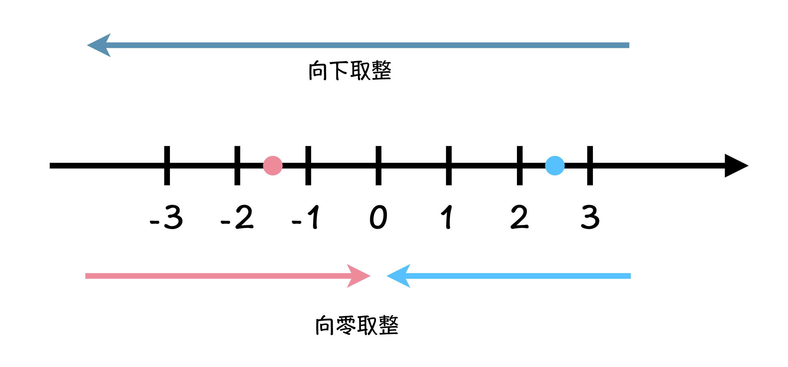

上一节中，咱们说了数学思维对于编程的重要性，并且跟你介绍了一种最重要的程序设计思维：数学归纳法。这个思维，不仅可以帮助我们设计程序，而且还可以帮助我们理解及证明程序的正确性。

不过说了这些数学对编程的重要性，可能你还觉得不过瘾，感觉只是停留在理论层面，还是有一层窗户纸没有捅破。今天呢，我就给你带来一道具体的编程问题。

首先，我们先看一道很简单的数学问题，求出 1000 以内所有 3 或 5 倍数的数字的和。什么意思呢？我们先缩小范围，就是求 10 以内，所有 3 或 5 的倍数。我们很快就能找到，这里有 3、5、6、9 ，它们相加之和是 23。注意，这里说的是 10 以内，所以不包括 10。

回到 1000 以内这个原问题，这个问题其实很简单，可能你现在就想马上撸起袖子开始写代码了。可别急，听我给你分析分析怎么做，才算是又好又快地用程序，解决这个实际的数学问题。

#### 1.把计算过程，交给计算机

我们写程序的一个目的，就是减少我们人类在解决问题中的**具体计算过程**，那什么叫做具体计算过程呢？

例如，当你写一行代码“ 3 + 5 ”的时候，这是把计算过程交给了计算机，而如果你直接在程序中写上了 8 这个结果的时候，相当于你自己做了这个计算过程。因此，所谓减少我们的具体计算过程，就是能在程序中写 3 + 5，就写 3 + 5，不要写 8。

这就是我要强调的，要把计算过程交给计算机来做，而不是我们自己来做，毕竟计算机是很擅长做这种事情的，你没必要替它省这个事儿。在这样的指导思想下，我们先来看下面这段

```c
#include <stdio.h>
int main() {
    int sum = 0;
    for (int i = 1; i < 1000; i++) {
        sum += i * (i % 3 == 0 || i % 5 == 0);  
    }
    printf("%d\n", sum);
    return 0;
}
```

这段程序中，循环遍历 1000 以内的所有整数，然后把 3 或 5 的倍数累加到变量 sum 中，

最后输出 sum 变量的值，就是 1000 以内，所有 3 或 5 的倍数和。**其中有一个编程技巧，就是利用条件表达式 (i % 3 == 0 || i % 5 == 0) 与数字 i 相乘，条**

**件表达式等于 1 的时候，说明 i 是 3 或 5 的倍数，sum 累加的值就是 i * 1 就是 i 的值；**

而当条件表达式不成立的时候，sum 累加的值就是 0。**掌握这个编程技巧，关键是理解条件表达式的值。**

#### 2. 数学思维：提升计算效率

而在编程中呢，计算机其实就像示例中的工人，你教给它什么方法，它就执行什么方法，任务完成的效率，和计算机没关系，而是和你完成程序，所教给计算机的方法有关系。这个方法呢，就是我们前文中所说的“算法”。

再回到之前那个要求出 1000 以内所有 3 或 5 倍数的数字和的程序，程序虽然完成了任务，可是完成的效率不够高效。

下面我们就把数学类的算法思维，加进程序中，看看效果吧。记住，加入数学思维的同时，也要保证，将计算过程留给计算机。首先来看如下程序：

```c
#include <stdio.h>
int main() {
    int sum3 = (3 + 999 / 3 * 3) * (999 / 3) / 2;
    int sum5 = (5 + 999 / 5 * 5) * (999 / 5) / 2;
    int sum15 = (15 + 999 / 15 * 15) * (999 / 15) / 2;
    printf("%d\n", sum3 + sum5 - sum15);
    return 0;
}
```

上面程序中，有三个整型变量分别代表 1000 以内所有 3 的倍数的和 sum3，所有 5 的倍数的和 sum5，和所有 15 倍数的和 sum15。最后呢，用 sum3 + sum5 - sum15 的值，代表了 3 或 5 的倍数的和。你对这个结果可能有点反应不过来，听我继续给你解释。

而对于这段代码呢，咱们可以详细解释一下，首先用 1000 以内最后一个数字 999 除以5，会得到在 1000 以内 5 的倍数有多少个。为什么会得到这个结果呢？这个就要说说 C 语言中的整型间的除法问题了。

在 C 语言中，两个整型数字相除，结果会做**向零取整**，什么是 向零取整呢？解释这个概念之前，先要介绍一下**向下取整**的概念，所谓向下取整，就是取小于等于当前数字的第一个整数。

例如，4.9 向下取整，就是 4，因为小于等于 4.9 的第一个整数就是 4。那么 -1.5 向下取整等于多少呢？这里需要注意，结果是 -2，不是 -1，因为小于等于 -1.5 的第一个整数是-2，而 -1 比 -1.5 要大。

当你明白了什么是向下取整以后，就很好理解向零取整了，那就是取当前数字和 0 之间，与前数字距离最近的整数。对于正数来说，向零取整的结果和向下取整的结果相同，而对于负数来说结果恰好相反。咱们还是拿 -1.5 举例，向下取整是 -2，可是向零取整就不同了，向零取整是在当前数字与0 之间，取一个距离当前数字最近的整数，取到的就是 -1。



理解了 C 语言中的整数除法规则以后，我们再回到题目中看一下，题目中用 999 / 5 得到的就是 1000 以内有多少个 5 的倍数的数字，然后再用这个数字乘以 5 就得到了 1000 以内，最后一个 5 的倍数的数字。

#### 一起动手，搞事情

在做今天的思考题之前，我们先来弄清楚两个说法，“平方和”以及“和的平方”。

例如，10 以内自然数的平方和就是：

1^2 + 2^2 + 3^2 + 4^2 + 5^2 + 6^2 + 7^2 + 8^2 + 9^2 + 10^2 = **385**

也就是 1 到 10 每个数字的平方相加之和。而，10 以内自然数的和的平方就是：

(1 + 2 + 3 + 4 + 5 + 6 + 7 + 8 + 9 + 10) ^ 2 = **3025**

也就是 1 到 10 所有数字相加之和，然后再取平方的值。

#### 思考题：和的平方减平方和

今天我们的思考题呢，分成两个子问题：

1. 请编写一个程序，计算 100 以内自然数“和的平方”与“平方和”的差。

2. 通过今天的学习，我们复习了等差数列求和公式，那你能否通过查阅资料，推导得到等差数列的平方和公式呢？