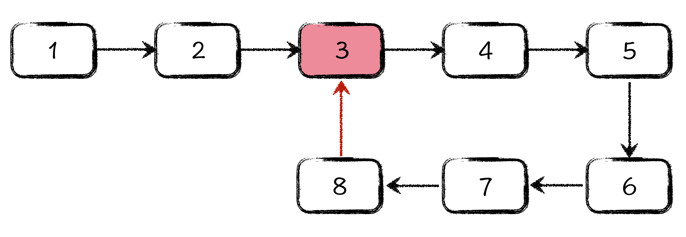
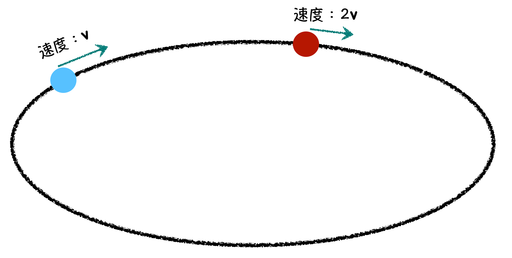

我们经常听到，算法中最有价值的是“算法思维”，其实在数据结构中，最有价值的也是“数据结构思维”。今天呢，我们就看看链表这种具体的数据结构，如何变成一种思维层面的数据结构，辅助我们进行思考。

#### 今日任务

先来看一下今天这 10 分钟的任务吧。首先，我们定义一种数字名称，叫做“快乐数”。所谓快乐数就是经过有限次变换以后，等于 1 的数字。这个变换规则，给出一个非 1 的数字a ，把它的位数拎出来，求各个位数的平方和，得到一个数字 b，如果数字 b 不是 1，那就对数字 b 的每一位数再做平方和，得到数字 c……经过不停的变换，确定最后能否得到 1。

例如，一开始的数字是 19，经过变换规则 1²+ 9² = 82，得到数字 82；因为不是 1 ，所以接着做变换，就是 8²  + 2²  = 68，再做一次变换 6²  + 8² = 100，最后一次做变换 1²  + 0² + 0² = 1，得到了 1 以后，停止。

由于从 19 开始，通过有限次变换以后，能够到达数字 1，所以数字 19 是“快乐数”。在这个过程中，你应该明白，后面得到的 82、68、100 其实也是快乐数。所以今天我们要做的，就是给出一个正整数，你来判断这个数字是否是快乐数。

这个任务的难点，不在于判定哪些数字是快乐数，而在于如何判定一个数字不是快乐数。为什么这么说呢？因为不是快乐数，就说明原数字没有办法通过有限次变换，到达数字 1，那么经过多少次，才算是有限次呢？1 千次，1 万次还是 10 万次呢？你会发现，很难确定这个转换次数的上限。

你可能已经感觉到了这是一个有趣，但似乎又有点难度的任务。那就请你带着这份好奇和困惑，让我们用链表思维解决它！

#### **1.** 直观操作法：用数组判断链表中是否有环

如何判断一个链表中有环。链表中为什么会有环呢？通过上一节课的学习，我们知道单向链表的最后一个节点，原本应该指向一个叫做NULL 的空地址，代表整个链表结束。可你有没有想过，如果链表的最后一个节点，指向的不是一个空地址，而是链表中的一个点，那是不是就形成了链表内部的一个环？



就如你所看到的，图中的 8 号节点，本应该是链表的最后一个节点，可它却指向了 3 号节点，这样就形成了一个以 3、4、5、6、7、8 号节点为循环状态的环形结构。当你使用指针遍历这个链表的时候，将会永无尽头。

那有没有什么办法，能够帮助我们判断在一个单向链表中，是否存在环呢？面对这个问题，你可能想要说，很简单啊，我只需要使用一个数组，记录出现过的节点信息，之后每次遍历到新节点，就判断这个节点是否在数组中有记录。如果有的话，说明链表中有环，如果遍历到了 NULL 地址，那就说明链表中无环。

上面这个方法看似可行，但数组会占用与链表等量的额外存储空间，并且效率太差了。假设链表有 n 个节点，当你经过第 1 个节点的时候，你需要在数组中查找 0 次；第 2 个节点的时候，需要在数组中查找 1 次；第 3 个节点需要查找 2 次。

依次类推，第 i 个节点，你需要在数组中查找 i - 1 次，可直到你遍历到第 n + 1 个节点的时候，才会发现有重复。此时在数组中查找的总次数将会是 (n + 1) * n / 2 次，接近于 n²次，这种时间复杂度，写作 *O*(*n*²)。

#### 2.快慢指针法：让判断链表是否有环变得简单



简单来说，就是我们把链表当成跑道，放上两个指针，一个指针每次走一步，另一个指针每次走两步，如果快的指针，先跑到了终点，说明链表中没有环，如果两个指针相遇了，则说明链表中有环。并且，我们很容易知道两个指针一定是在环内部相遇的。

如果把上述过程写成代码的话，如下所示：

```c
int hasCycle(struct Node *head) {
    if (head == NULL) return 0;
    // p 是慢指针，q 是快指针
    struct Node *p = head, *q = head;
    // 每次循环，p 走1步，q 走2步
    do {
        p = p->next;
        q = q->next;
        if (q == NULL) return 0;
        q = q->next;
    } while (p != q && q); 
    return p == q;
}
```

代码比较简单，你可以自行阅读并学习。其中需要注意的是几个指针判空的语句，一定要保证指针非空的前提下，再用指针间接访问结构体字段，否则你的程序会瞬间崩溃。

#### 一起动手，搞事情

前面讲了，如何判断链表有环。那么今天的“一起动手，搞事情”环节呢，我就给你留两个相关的子问题：

1. 如何求解环的长度，如图 1 中，环的长度就是 5。

2. 如何找到环的起点，如图 1 中，3 号点，就是环的起始点。

#### 快乐数判定问题

准备完了前面这些基础知识以后，你可能还是摸不着头绪，不知道如何解决快乐数判定问题。那你可要跟住节奏了，下面就要进入将链表数据结构提升成为思维的阶段了。

首先，我们知道，整型表示的最大值是 2的31次方 − 1，大约是 20 亿左右。如果就在这个整型范围内解决快乐数判定的问题，我们可以得到哪些有用的结论呢？下面，让我们分析一下。由本节开头的例子可知，从 19 开始，依次得到的是：82、68、100、1 这些数字。也就是说，从一个数字开始，按照快乐数的计算规则，会得到一串数字序列。这其中就蕴含着链表重要的结构思维：从当前节点，唯一映射到下一个节点。快乐数序列中的数字，就是链表中的节点，如果当前数字确定了，下一个数字也就是确定了的，就像数字 19，下一个肯定是数字 82，这种映射规则，就是链表节点之间的指向关系。

最后，我们做一个思维映射，一切就豁然开朗了。所谓快乐数序列，最终的目标是能到 1，这个数字 1，其实就可以看成是链表中的空地址。这样，我们就把快乐数问题，用链表思维做了一番改造，并且这种改造，一点儿违和感都没有。当你把这个思考过程搞清楚后，恭喜你，在这个过程中，你正在将你自己看待问题的方式，变得更加结构化，更加计算机化。

接下来我们分析一下，这个快乐数链表，最长能有多长？这个问题其实比较好分析，主要是思考究竟哪个数字，按照快乐数的计算规则，得到的下一个数字是最大的，这个最大的数字是多少。稍加思索，你就知道，如果在整型范围内解决快乐数问题的话，1999999999 这个数字，按照各位平方和来进行计算，得到的下一个数字应该是 (9 ∗ 9² + 1) = 730，也就是说，这个快乐数链表中，节点数量绝对不会超过 731 个。一个不超过 731 个节点的链表，还总也走不到末尾，说明什么？说明这个链表中有环！

至此，你会发现，**判断一个数字是否是快乐数，等价于判断链表中是否有环**。剩下的台词，我就不和你抢了，舞台留给你来发挥吧，代码我就不替你写了。加油！我相信，你一定写得出来。

#### 课程小结

关于链表的内容，到这里就结束了。通过这两节，只是想让你记住一点：数据结构，不仅仅是计算机中的代码，更是我们思维的逻辑结构在计算机科学中的具体体现。

这种有趣的思维变换，才是算法和数据结构的真正魅力所在。有些技术的酷炫，是长在脸上的，让人一眼就能看到；而算法和数据结构的酷炫，从来都是那样的含蓄，那样的内敛，你只有深入到里面，才能感受到它的巨大魅力。我已经竭尽所能，试图将它的内在美描述出来，不知道你有没有 get 到，如果你没有 get 到，那一定是我的语言太过苍白，而不是算法数据结构没有魅力！