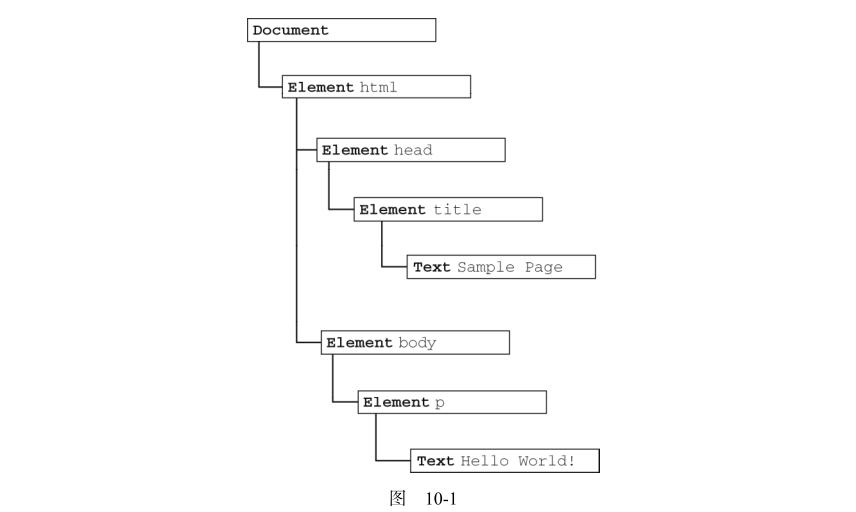
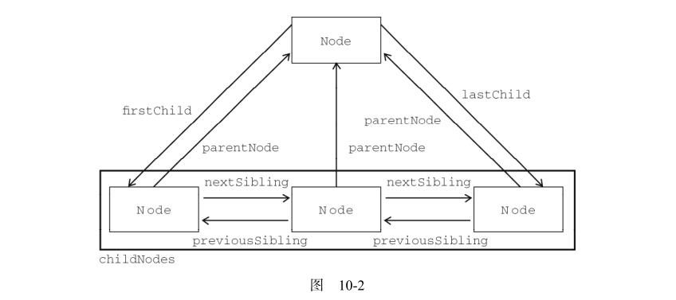

# 第10章 DOM

**DOM（文档对象模型）**是针对 HTML 和 XML 文档的一个 API（应用程序编程接口）。DOM 描绘了一个层次化的节点树，允许开发人员添加、移除和修改页面的某一部分。DOM 脱胎于Netscape 及微软公司创始的 DHTML（动态 HTML），但现在它已经成为表现和操作页面标记的真正的**跨平台、语言中立**的方式。

本章主要讨论与浏览器中的 HTML 页面相关的 DOM1 级的特性和应用，以及 JavaScript 对 DOM1 级的实现。
IE、Firefox、Safari、Chrome 和 Opera 都非常完善地实现了 DOM。

## 10.1节点层次

DOM 可以将任何 HTML 或 XML 文档**描绘成一个由多层节点构成的结构**。

节点分为几种不同的类型，每种类型分别表示文档中不同的信息及（或）标记。

每个节点都拥有各自的**特点、数据**和**方法**，另外也与其他节点存在某种关系。节点之间的关系构成了层次，而所有页面标记则表现为一个**以特定节点为根节点的树形结构**。以下面的 HTML 为例：

```html
<html>
	<head>
		<title>Sample Page</title>
	</head>
	<body>
		<p>Hello World!</p>
	</body>
</html>
```

可以将这个简单的 HTML 文档表示为一个层次结构，如图 10-1 所示。

在这个例子中，文档节点只有一个子节点，即 <html> 元素，我们称之为**文档元素**。文档元素是文档的最外层元素，文档中的其他所有元素都包含在文档元素中。**每个文档只能有一个文档元素。**



每一段标记都可以通过树中的一个节点来表示：HTML 元素通过**元素节点**表示，特性（attribute）通过特性节点表示，文档类型通过**文档类型节点**表示，而注释则通过注释节点表示。总共有 12 种节点类型，这些类型都继承自一个基类型。

### 10.1.1Node类型

每个节点都有一个 nodeType 属性，用于表明节点的类型。节点类型由在 Node 类型中定义的下列12 个数值常量来表示，任何节点类型必居其一：

* Node.ELEMENT_NODE (1)
* Node.ATTRIBUTE_NODE (2)
* Node.TEXT_NODE (3)
* Node.CDATA_SECTION_NODE (4)
* Node.ENTITY_REFERENCE_NODE (5)
* Node.ENTITY_NODE (6)
* Node.PROCESSING_INSTRUCTION_NODE (7)
* Node.COMMENT_NODE (8)
* Node.DOCUMENT_NODE (9)
* Node.DOCUMENT_TYPE_NODE (10)
* Node.DOCUMENT_FRAGMENT_NODE (11)
* Node.NOTATION_NODE (12)

通过比较上面这些常量，可以很容易地确定节点的类型，例如：

```javascript
if (someNode.nodeType == 1){ // 适用于所有浏览器
	alert("Node is an element.");
}
```

##### 1.  nodeName 和 nodeValue 

要了解节点的具体信息，可以使用 nodeName 和 nodeValue 这两个属性。

```javascript
if (someNode.nodeType == 1){
	value = someNode.nodeName; //nodeName 的值是元素的标签名
}
```

在这个例子中，首先检查节点类型，看它是不是一个元素。如果是，则取得并保存 nodeName 的值。**对于元素节点， nodeName 中保存的始终都是元素的标签名，而 nodeValue 的值则始终为 null 。**

##### 2. 节点关系

每个节点都有一个 childNodes 属性，其中保存着一个 NodeList 对象。 NodeList 是一种类数组对象，用于保存一组有序的节点，可以通过位置来访问这些节点。

NodeList 对象的独特之处在于，它实际上是基于 DOM 结构动态执行查询的结果，因此 **DOM 结构的变化能够自动反映在 NodeList 对象中。**

下面的例子展示了如何访问保存在 NodeList 中的节点——可以通过方括号，也可以使用 item()方法。

```javascript
var firstChild = someNode.childNodes[0];
var secondChild = someNode.childNodes.item(1);
var count = someNode.childNodes.length;
```

每个节点都有一个 parentNode 属性，该属性指向文档树中的父节点。包含在 childNodes 列表中的所有节点都具有相同的父节点，因此它们的 parentNode 属性都指向同一个节点。

包含在childNodes 列表中的每个节点相互之间都是同胞节点。通过使用列表中每个节点的 previousSibling和 nextSibling 属性，可以访问同一列表中的其他节点。列表中第一个节点的 previousSibling 属性值为 null ，而列表中最后一个节点的 nextSibling 属性的值同样也为 null。

父节点与其第一个和最后一个子节点之间也存在特殊关系。父节点的 firstChild 和 lastChild属性分别指向其 childNodes 列表中的第一个和最后一个节点。如果没有子节点，那么 firstChild 和 lastChild 的值均为 null 。

图 10-2 形象地展示了上述关系。



另外， hasChildNodes() 也是一个非常有用的方法，这个方法在节点包含一或多个子节点的情况下返回 true ；应该说，这是比查询 childNodes列表的 length 属性更简单的方法。

所有节点都有的最后一个属性是 ownerDocument ，该属性指向表示整个文档的文档节点。

##### 3. 操作节点

最常用的方法是appendChild() ，用于向 childNodes 列表的末尾添加一个节点，返回新增的节点。

如果传入到 appendChild() 中的节点已经是文档的一部分了，那结果就是将该节点从原来的位置**转移**到新位置。**任何 DOM 节点不能同时出现在文档中的多个位置上。**

如下面的例子所示。

```javascript
//someNode 有多个子节点
var returnedNode = someNode.appendChild(someNode.firstChild);
alert(returnedNode == someNode.firstChild); //false
alert(returnedNode == someNode.lastChild); //true
```

如果需要把节点放在 childNodes 列表中某个特定的位置上，而不是放在末尾，那么可以使用insertBefore() 方法。

这个方法接受两个参数：要插入的节点和作为参照的节点。插入节点后，被插
入的节点会变成参照节点的前一个同胞节点（ previousSibling ），同时被方法返回。如果参照节点是null ，则 insertBefore() 与 appendChild() 执行相同的操作。

replaceChild() 方法接受的两个参数是：要插入的节点和要替换的节点。要替换的节点将由这个方法返回并从文档树中被移除，同时由要插入的节点占据其位置。

在使用 replaceChild() 插入一个节点时，该节点的所有关系指针都会从被它替换的节点复制过来。尽管从技术上讲，被替换的节点仍然还在文档中，但它在文档中已经没有了自己的位置。

如果只想移除而非替换节点，可以使用 removeChild() 方法。这个方法接受一个参数，即要移除的节点。被移除的节点将成为方法的返回值。

##### 4. 其他方法

有两个方法是所有类型的节点都有的。第一个就是 cloneNode() ，用于创建调用这个方法的节点的一个完全相同的副本。 

cloneNode() 方法接受一个布尔值参数，表示是否执行深复制。在参数为 true的情况下，执行深复制，也就是复制节点及其整个子节点树；在参数为 false 的情况下，执行浅复制，即只复制节点本身。

> cloneNode() 方法不会复制添加到 DOM 节点中的 JavaScript 属性，例如事件处理程序等。这个方法只复制特性、（在明确指定的情况下也复制）子节点，其他一切都不会复制。IE 在此存在一个 bug，即它会复制事件处理程序，所以我们建议在复制之前最好先移除事件处理程序。

我们要介绍的最后一个方法是 normalize() ，这个方法将当前节点和它的后代节点”规范化“（normalized）。在一个"规范化"后的DOM树中，不存在一个空的文本节点，或者两个相邻的文本节点。

### 10.1.2Document类型

在浏览器中， document 对象是 HTMLDocument （继承自 Document 类型）的一个实例，表示整个 HTML 页面。而且， document 对象是 window 对象的一个属性，因此可以将其作为全局对象来访问。

Document 节点具有下列特征：

* nodeType 的值为 9
* nodeName 的值为 "#document"
* nodeValue 的值为 null
* parentNode 的值为 null
* ownerDocument 的值为  null
* 其子节点可能是一个 DocumentType （最多一个）、 Element （最多一个）、 ProcessingInstruction或 Comment 

通过这个文档对象，不仅可以取得与页面有关的信息，而且还能操作页面的外观及其底层结构。

##### 1.文档的子节点

有两个内置的访问其子节点的快捷方式。第一个就是 documentElement属性，该属性始终指向 HTML 页面中的 `<html> `元素。

document 对象还有一个 body 属性，直接指向 `<body>`元素。因为开发人员经常要使用这个元素，所以 document.body 在 JavaScript代码中出现的频率非常高。

Document 另一个可能的子节点是 DocumentType 。通常将 <!DOCTYPE> 标签看成一个与文档其他部分不同的实体，可以通过 doctype 属性（在浏览器中是 document.doctype ）来访问它的信息。

```javascript
var doctype = document.doctype; //取得对<!DOCTYPE>的引用
```

##### 2. 文档信息

作为 HTMLDocument 的一个实例， document 对象还有一些标准的 Document 对象所没有的属性。其中第一个属性就是 title ，包含着`<title> `元素中的文本。

接下来要介绍的 3 个属性都与对网页的请求有关，它们是 URL 、 domain 和 referrer 。 URL 属性中包含页面完整的 URL（即地址栏中显示的 URL）， domain 属性中只包含页面的域名，而 referrer属性中则保存着链接到当前页面的那个页面的 URL。

在这 3 个属性中，只有 domain 是可以设置的。但由于安全方面的限制，也并非可以给 domain 设置任何值。如果 URL 中包含一个子域名，例如 p2p.wrox.com，那么就只能将 domain 设置为 "wrox.com"。

由于 跨 域 安 全 限 制 ， 来 自 不 同 子 域 的 页 面 无 法 通 过 JavaScript 通 信 。 而 通 过 将 每 个 页 面 的document.domain 设置为相同的值，这些页面就可以互相访问对方包含的 JavaScript 对象了。

浏览器对 domain 属性还有一个限制，即如果域名一开始是“松散的”（loose），那么不能将它再设置为“紧绷的”（tight）。换句话说，在将 document.domain 设置为 "wrox.com" 之后，就不能再将其设置回"p2p.wrox.com" ，否则将会导致错误，如下面的例子所示。

```javascript
//假设页面来自于 p2p.wrox.com 域
document.domain = "wrox.com"; //松散的（成功）
document.domain = "p2p.wrox.com"; //紧绷的（出错！）
```

##### 3. 查找元素

说到最常见的 DOM 应用，恐怕就要数取得特定的某个或某组元素的引用，然后再执行一些操作了。取得元素的操作可以使用 document 对象的几个方法来完成。其中， Document 类型为此提供了两个方法： getElementById() 和 getElementsByTagName() 。

如果页面中多个元素的 ID 值相同， getElementById() 只返回文档中第一次出现的元素。

 getElementsByTagName() 这个方法接受一个参数，即要取得元素的标签名，而返回的是包含零或多个元素的 NodeList 。在 HTML 文档中，这个方法会返回一个 HTMLCollection 对象。

```javascript
var images = document.getElementsByTagName("img")
```

> 这行代码会将一个 HTMLCollection 对象保存在 images 变量中，与 NodeList 对象类似。

HTMLCollection 对象还有一个方法，叫做 namedItem() ，使用这个方法可以通过元素的 name特性取得集合中的项。例如，假设上面提到的页面中包含如下 ` `元素：

```html

```

那么就可以通过如下方式从 images 变量中取得这个 ` `元素：

```javascript
var myImage = images.namedItem("myImage")
```

对命名的项也可以使用方括号语法来访问，如下所示：

```javascript
var myImage = images["myImage"]
```

第三个方法，也是只有 HTMLDocument 类型才有的方法，是 getElementsByName() 。顾名思义，这个方法会返回带有给定 name 特性的所有元素。

##### 4. 特殊集合

除了属性和方法， document 对象还有一些特殊的集合。这些集合都是 HTMLCollection 对象，为访问文档常用的部分提供了快捷方式，包括：

* document.anchors ，包含文档中所有带 name 特性的` <a> `元素
* document.applets ，包含文档中所有的 `<applet> `元素，因为不再推荐使用` <applet> `元素，所以这个集合已经不建议使用了
* document.forms ，包含文档中所有的` <form> `元素，与 document.getElementsByTagName("form")得到的结果相同
* document.images ，包含文档中所有的` ` 元素，与 document.getElementsByTagName("img") 得到的结果相同
* document.links ，包含文档中所有带 href 特性的 `<a>` 元素

##### 5. DOM 一致性检测

DOM1 级只为 document.implementation 规定了一个方法，即 hasFeature() 。这个方法接受两个参数：要检测的 DOM 功能的名称及版本号。如果浏览器支持给定名称和版本的功能，则该方法返回 true ，如下面的例子所示：

```javascript
var hasXmlDom = document.implementation.hasFeature("XML", "1.0");
```

##### 6. 文档写入

有一个 document 对象的功能已经存在很多年了，那就是将输出流写入到网页中的能力。这个能力体现在下列 4 个方法中： write() 、 writeln() 、 open() 和 close() 。其中， write() 和 writeln()方法都接受一个字符串参数，即要写入到输出流中的文本。 write() 会原样写入，而 writeln() 则会在字符串的末尾添加一个换行符（ \n ）。

```html
<html>
	<head>
		<title>document.write() Example</title>
	</head>
<body>
	<p>The current date and time is:
	<script type="text/javascript">
		document.write("<strong>" + (new Date()).toString() + "</strong>");
	</script>
	</p>
</body>
</html>
```

这个例子展示了在页面加载过程中输出当前日期和时间的代码。其中，日期被包含在一个` <strong>`元素中，就像在 HTML 页面中包含普通的文本一样。这样做会创建一个 DOM 元素，而且可以在将来访问该元素。

还可以使用 write() 和 writeln() 方法动态地包含外部资源，例如 JavaScript 文件等。在包含 JavaScript 文件时，必须注意不能像下面的例子那样直接包含字符串 `</script>` ，因为这会导致该字符串被解释为脚本块的结束，它后面的代码将无法执行。

```html
<html>
	<head>
		<title>document.write() Example 2</title>
	</head>
<body>
	<script type="text/javascript">
	document.write("<script type=\"text/javascript\" src=\"file.js\">" +
	"</script>");
	</script>
</body>
</html>
```

解决方案如下：

```js
<html>
	<head>
		<title>document.write() Example 2</title>
	</head>
<body>
	<script type="text/javascript">
	document.write("<script type=\"text/javascript\" src=\"file.js\">" +
	"<\/script>");
	</script>
</body>
</html>
```

### 10.1.3 Element类型

* 除了 Document 类型之外， Element 类型就要算是 Web 编程中最常用的类型了。
* 要访问元素的标签名，可以使用 nodeName 属性，也可以使用 tagName 属性。
* 操作特性的DOM 方法主要有三个，分别是 getAttribute()、 setAttribute()和 removeAttribute()。
* 有两类特殊的特性，它们虽然有对应的属性名，但属性的值与通过 getAttribute()返回的值并不相同。第一个是style，第二个是类似onclick这样的事件处理程序。
* 通过 setAttribute()方法可以设置自定义属性值，但是通过赋值的方式无法做到这一点。例如：

```javascript
div.mycolor = "red";// 无效
alert(div.getAttribute("mycolor")); //null（ IE 除外）
```

* 使用 document.createElement()方法可以创建新元素。这个方法只接受一个参数，即要创建元素的标签名。

### 10.1.4 Text类型

* nodeName 的值为"#text"。
* nodeValue 的值为节点所包含的文本。
* 可以通过 nodeValue 属性或 data 属性访问(修改) Text 节点中包含的文本。
* 一般情况下，每个元素只有一个文本子节点。不过，在某些情况下也可能包含多个文本子节点。
* 如果在一个包含两个或多个文本节点的父元素上调用 normalize()方法，则会将所有文本节点合并成一个节点，结果节点的 nodeValue 等于将合并前每个文本节点的 nodeValue 值拼接起来的值。
* 可以使用 document.createTextNode()创建新文本节点，这个方法接受一个参数——要插入节点中的文本。
* Text 类型提供了一个作用与 normalize()相反的方法： splitText()。这个方法会将一个文本节点分成两个文本节点。原来的文本节点将包含从开始到指定位置之前的内容，新文本节点将包含剩下的文本。

### 10.1.5 Comment类型

* nodeName 的值为"#comment"。
* Comment 类型与 Text 类型继承自相同的基类，因此它拥有除 splitText()之外的所有字符串操作方法。与 Text 类型相似，也可以通过 nodeValue 或 data 属性来取得注释的内容。
* 可以使用 document.createComment()，并为其传递注释文本创建注释节点。

### 10.1.6 CDATASection类型

极少用，不写了

### 10.1.7 DocumentType类型

不常用，不写了。

### 10.1.8 DocumentFragment类型

* 是一种“轻量级”的文档，可以包含和控制节点，但不会像完整的文档那样占用额外的资源。 
* 用途：假设我们想为这个<ul>元素添加 3 个列表项。如果逐个地添加列表项，将会导致浏览器反复渲染。为避免这个问题，可以像下面这样使用一个文档片段来保存创建的列表项，然后再一次性将它们添加到文档中。

```javascript
var fragment = document.createDocumentFragment();
var ul = document.getElementById("myList");
var li = null;
for (var i=0; i < 3; i++){
    li = document.createElement("li");
    li.appendChild(document.createTextNode("Item " + (i+1)));
    fragment.appendChild(li);
}
ul.appendChild(fragment);
```

## 10.2 DOM 操作技术

很多时候， DOM 操作都比较简明，因此用 JavaScript 生成那些通常原本是用 HTML 代码生成的内容并不麻烦。不过，也有一些时候，操作 DOM 并不像表面上看起来那么简单。由于浏览器中充斥着隐藏的陷阱和不兼容问题，用 JavaScript 代码处理 DOM 的某些部分要比处理其他部分更复杂一些。

### 10.2.1 动态脚本

 动态载入脚本

```js
function loadScript(url){
    var script = document.createElement("script");
    script.type = "text/javascript";
    script.src = url;
    document.body.appendChild(script);
}
```

### 10.2.2 动态样式

动态载入样式

```javascript
function loadStyles(url){
    var link = document.createElement("link");
    link.rel = "stylesheet";
    link.type = "text/css";
    link.href = url;
    var head = document.getElementsByTagName("head")[0];
    head.appendChild(link);
}
```

### 10.2.3 操作表格

略

### 10.2.4 使用NodeList

NodeList是动态的，每当文档变更时，NodeList总是保持最新状态。从性能方面来讲，应该尽量少访问NodeList，因为每次访问NodeList，都会运行一次基于文档的查询。
