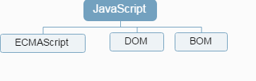
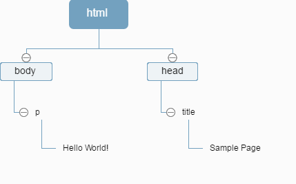

## JavaScript 简介

* JavaScript诞生于1995 年，至今已有二十多年。

* 起初用于简单的数据验证。

* 现已发展成为一门强大的编程语言。

* 它既简单——入门快。

* 又复杂——学得越多，越觉得学得还不够多。


## JavaScript简史

1995年，**Netscape** 公司为了服务其Netscape Navigator 2浏览器，开发了名为LiveScript 的脚本语言。

在Netscape Navigator 2 正式发布前夕，Netscape 搭上媒体热炒Java 的顺风车，把**LiveScript** 改名为JavaScript。

JavaScript 1.0获得巨大成功，微软就在其IE 3 中加入了名为**JScript** 的JavaScript 实现，这意味着有了两个不同的JavaScript 版本：Netscape公司的JavaScript，以及微软公司的JScript。

欧洲计算机制造商协会（ECMA）委派各公司中的精英，完成了一种名为ECMAScript的标准。

## JavaScript实现

一个完整的JavaScript实现由一下三部分组成：

- 核心（ECMAScript）
- 文档对象模型（DOM）
- 浏览器对象模型（BOM）



## ECMAScript

实现ECMAScript 的宿主环境：Web浏览器、[Node](http://nodejs.cn/)（一种服务端JavaScript 平台）、Adobe Flash等。

TC39：由来自Netscape、Sun、微软、Borland 及其他关注脚本语言发展的公司的程序员组成，负责建立、推进ECMAScript 标准。

第3 版标志着ECMAScript 成为了一门真正的编程语言。

***补充***

ECMAScript 产生过程：

- 阶段 0：Strawman 初稿
- 阶段 1：Proposal 建议
- 阶段 2：Draft 草案
- 阶段 3：Candidate 候选
- 阶段 4：Finished 完成

[ES7特性](http://www.2ality.com/2016/02/ecmascript-2017.html)

[ES6特性](http://es6-features.org/)

## 文档对象模型（DOM）

文档对象模型（DOM），全称 Document Object Model，是针对XML 但经过扩展用于HTML 的应用程序编程接口（API，Application Programming Interface）。

借助DOM 提供的API，开发人员可以轻松自如地删除、添加、替换或修改任何节点。

**DOM 并不只是针对JavaScript 的，其他语言也都实现了DOM**。

示例HTML：

```html
<html>
	<head>
		<title>Sample Page</title>
	</head>
	<body>
		<p>Hello World!</p>
	</body>
</html>
```

对应的DOM为：



## 浏览器对象模型（BOM）

开发人员使用BOM 可以控制浏览器显示的页面以外的部分。

JavaScript中的以下扩展，一般可作为BOM的组成部分：

- 弹出新浏览器窗口的功能
- 移动、缩放和关闭浏览器窗口的功能
- 提供浏览器详细信息的 **navigator **对象
- 提供浏览器所加载页面的详细信息的 **location** 对象
- 提供用户显示器分辨率详细信息的 **screen** 对象
- 对cookies 的支持
- 像XMLHttpRequest 和IE 的ActiveXObject 这样的自定义对象
