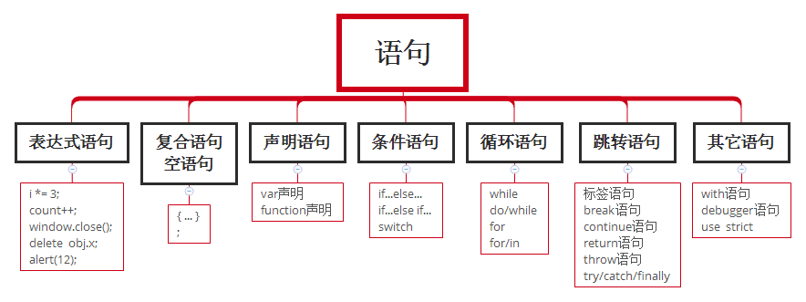

# 第3章 基本概念

任何语言的核心都必然会描述这门语言最基本的工作原理：

- 语法
- 数据类型
- 流控制语句
- 函数

## 3.1语法

ECMAScript 的语法大量借鉴了C 及其他类C 语言（如Java 和Perl）的语法。

熟悉这些语言的开发人员在接受ECMAScript 更加宽松的语法时，一定会有一种轻松自在的感觉。

即使没有其他编程语言基础，JavaScript仍然易上手。

### 3.1.1区分大小写

ECMAScript 中的一切（变量、函数名和操作符）都区分大小写。

变量名**test** 和变量名**Test** 分别表示两个不同的变量。

### 3.1.2标识符

**标识符**，就是指变量、函数、属性的名字，或者函数的参数，规则：

- 第一个字符必须是一个字母、下划线（_）或一个美元符号（$）
- 其他字符可以是字母、下划线、美元符号或数字

> 标识符中的字母也可以包含扩展的ASCII 或Unicode 字母字符（如À和Æ），但不推荐这样做。

ECMAScript 标识符采用驼峰大小写格式：

```javascript
var firstSecond
var myCar
var doSomethingImportant
```

### 3.1.3注释

ECMAScript 使用C 风格的注释，包括**单行注释**和**块级注释**：

```javascript
// 单行注释
```

```javascript
/*
* 这是一个多行
* （块级）注释
*/
```

> 虽然上面注释中的第二和第三行都以一个星号开头，但这不是必需的。之所以添加那两个星号，纯
> 粹是为了提高注释的可读性

### 3.1.4严格模式

ECMAScript 5 引入了严格模式（strict mode）的概念。

在严格模式下，ECMAScript 3 中的一些不确定的行为将得到处理，而且对某些不安全的操作也会抛出错误。

要在整个脚本中启用严格模式，可以在顶部添加如下代码：

```javascript
"use strict";
```

在函数内部的上方包含这条编译指示，也可以指定函数在严格模式下执行：

```javascript
function doSomething(){
	"use strict";
	//函数体
}
```

### 3.1.5语句

ECMAScript 中的语句以一个分号结尾；如果省略分号，则由解析器确定语句的结尾：

```javascript
var sum = a + b // 即使没有分号也是有效的语句
var diff = a - b; // 有效的语句
```

> 加上分号也会在某些情况下增进代码的性能，因为这样解析器就不必再花时间推测应该在哪里插入分号了

最佳实践是始终在控制语句中使用代码块：

```javascript
if (test)
	alert(test); // 有效但容易出错，不要使用

if (test){ // 推荐使用
	alert(test);
}
```

## 3.2关键字和保留字

具有特定用途的，目前全部**关键字**：

`break` `do` `instanceof` `typeof` `case` `else` `new` `var` `catch` `finally` `return` `void`

`continue` `for` `switch` `while` `debugger` `function` `this` `with` `default` `if` 

`throw` `delete` `in` `try` `let`

有可能在将来被用作关键字——**保留字**

`abstract` `enum` `int` `short` `boolean` `export` `interface` `static` `byte` `extends` 

`long` `super` `char` `final` `native` `synchronized` `class` `float` `package` `throws`

`const` `goto` `private` `transient` `debugger` `implements` `protected` `volatile`

`double` `import` `public`

### 3.3变量

ECMAScript 的变量是松散类型的，所谓松散类型就是可以用来保存任何类型的数据。

给未经声明的变量赋值在严格模式下会导致抛出**ReferenceError** 错误。

可以使用一条语句定义多个变量

```javascript
var message = "hi",
	found = false,
	age = 29;
```

> 虽然代码里的换行和变量缩进不是必需的，但这样做可以提高可读性。

## 3.4数据类型

有5 种简单数据类型，也称为基本数据类型：

- Undefine
- Null
- Boolean
- Number
- String

还有1 种复杂数据类型——Object

由于ECMAScript 数据类型具有动态性，因此的确没有再定义其他数据类型的必要。

### 3.4.1typeof操作符

检测给定变量的**数据类型**——typeof

对一个值使用typeof 操作符可能返回下列某个**字符串**：

- "undefined"——如果这个值未定义
- "boolean"——如果这个值是布尔值
- "string"——如果这个值是字符串
- "number"——如果这个值是数值
- "object"——如果这个值是对象或null
- "function"——如果这个值是函数

例子：

```javascript
var message = "some string";
alert(typeof message);  // "string"
alert(typeof(message)); // "string"
alert(typeof 95); 		// "number"
```

> typeof 是一个操作符而不是函数，因此例子中的圆括号尽管可以使用，但不是必需的

### 3.4.2Undefined类型

Undefined 类型只有一个值，即特殊的undefined

在使用var 声明变量但未对其加以初始化时，这个变量的值就是undefined

```javascript
var message;
alert(message == undefined); //true
```

对未初始化的变量执行typeof 操作符会返回undefined 值，而对未声明的变量执行typeof 操作符同样也会返回undefined 值。

```javascript
var message; // 这个变量声明之后默认取得了undefined 值
// 下面这个变量并没有声明
// var age
alert(typeof message); // "undefined"
alert(typeof age); // "undefined"
```

### 3.4.3Null类型

Null 类型是第二个只有一个值的数据类型，这个特殊的值是null。

从逻辑角度来看，**null 值表示一个空对象指针**，而这也正是使用typeof 操作符检测null 值时会返回"object"的原因

undefined 值是派生自null 值的，所以：

```javascript
alert(null == undefined); //true
```

### 3.3.4Boolean类型

Boolean 类型是ECMAScript 中使用得最多的一种类型，该类型只有两个字面值：true 和false。

true 和false 是区分大小写的。True 和False（以及其他的混合大小写形式）都不是Boolean 值，只是标识符。

Boolean转换规则：

| 数据类型  | 转换为true的值               | 转换为false的值 |
| --------- | ---------------------------- | --------------- |
| Boolean   | true                         | false           |
| String    | 任何非空字符串               | 空字符串        |
| Number    | 任何非零数字值（包括无穷大） | 0和NaN          |
| Object    | 任何对象                     | null            |
| Undefined | *不适合这种规则              | undefined       |

### 3.4.5Number类型

##### *浮点数值*

除了以十进制表示外，整数还可以通过八进制（以8 为基数）或十六进制（以16 为基数）的字面值
来表示。其中，八进制字面值的第一位必须是零（0），然后是八进制数字序列（0～7）。如果字面值中的
数值超出了范围，那么前导零将被忽略，后面的数值将被当作十进制数值解析。

```javascript
var octalNum1 = 070; // 八进制的56
var octalNum2 = 079; // 无效的八进制数值——解析为79
var octalNum3 = 08; // 无效的八进制数值——解析为8
```

> 八进制字面量在严格模式下是无效的，会导致支持的JavaScript 引擎抛出错误

由于保存浮点数值需要的内存空间是保存整数值的两倍，因此ECMAScript 会不失时机地将浮点数值转换为整数值。显然，如果小数点后面没有跟任何数字，那么这个数值就可以作为整数值来保存。

在默认情况下，ECMASctipt 会将那些小数点后面带有6 个零以上的浮点数值转换为以e 表示法
表示的数值（例如，0.0000003 会被转换成3e.7）。

IEEE754 标准导致的误差

```javascript
var sum=0.1+0.2
sum==0.3 //false sum=0.30000000000000004
```

##### *数值范围*

最小数值：Number.MIN_VALUE，5e-324

最大数值：Number.MAX_VALUE，1.7976931348623157e+308

超出数值范围：-Infinity（负无穷）Infinity（正无穷）

判断一个数值是不是**有穷**数值：isFinite()

```javascript
var result = Number.MAX_VALUE + Number.MAX_VALUE;
alert(isFinite(result)); //false
```

##### ***NaN***

NaN，即非数值（Not a Number）是一个特殊的数值，用于表示一个本来要返回数值的操作数未返回数值的情况，比如任何数值除以0会返回NaN。

NaN两个特性：

- 任何涉及NaN 的操作都会返回NaN
- NaN 与任何值都不相等，包括NaN 本身

***数值转换***

有3 个函数可以把非数值转换为数值：Number()、parseInt()和parseFloat()

Number()函数转换规则：

* true 和false 将分别被转换为1 和0
* 如果是数字值，只是简单的传入和返回
* 如果是null 值，返回0
* 如果是undefined，返回NaN
* 如果是字符串，遵循下列规则：
  * 如果字符串中只包含数字（包括前面带正号或负号的情况），则将其转换为十进制数值，即"1"
    会变成1，"123"会变成123，而"011"会变成11（忽略前导零）
  * 如果字符串中包含有效的浮点格式，如"1.1"，则将其转换为对应的浮点数值（忽
    略前导零）
  * 如果字符串中包含有效的十六进制格式，例如"0xf"，则将其转换为相同大小的十进制整
    数值
  * 如果字符串是空的（不包含任何字符），则将其转换为0
  * 如果字符串中包含除上述格式之外的字符，则将其转换为NaN

Number()函数使用举例：

```javascript
var num1 = Number("Hello world!"); //NaN
var num2 = Number(""); //0
var num3 = Number("000011"); //11
var num4 = Number(true); //1
```

parseInt()函数使用举例：

```javascript
var num1 = parseInt("1234blue"); // 1234
var num2 = parseInt(""); // NaN
var num3 = parseInt("0xA"); // 10（十六进制数）
var num4 = parseInt(22.5); // 22
var num5 = parseInt("070"); // 在ES3下等于56（八进制数）在ES5下等于70（十进制）
var num6 = parseInt("70"); // 70（十进制数）
var num7 = parseInt("0xf"); // 15（十六进制数）
var num8 = parseInt(".12");//NaN
```

parseFloat()函数使用举例：

```javascript
var num1 = parseFloat("1234blue"); //1234 （整数）
var num2 = parseFloat("0xA"); //0
var num3 = parseFloat("22.5"); //22.5
var num4 = parseFloat("22.34.5"); //22.34
var num5 = parseFloat("0908.5"); //908.5
var num6 = parseFloat("3.125e7"); //31250000
```

### 3.4.6String类型

String 数据类型包含一些特殊的字符字面量，也叫转义序列，用于表示非打印字符，或者具有其他用途的字符

| 字面量 | 含义                                                         |
| ------ | ------------------------------------------------------------ |
| \n     | 换行                                                         |
| \t     | 制表                                                         |
| \b     | 空格                                                         |
| \r     | 回车                                                         |
| \f     | 进纸                                                         |
| \\     | 斜杠                                                         |
| \'     | 单引号（'），在用单引号表示的字符串中使用。例如：'He said, \'hey.\'' |
| \"     | 双引号（"），在用双引号表示的字符串中使用。例如："He said, \"hey.\"" |
| \xnn   | 以十六进制代码nn表示的一个字符（其中n为0～F）。例如，\x41表示"A" |
| \unnnn | 以十六进制代码nnnn表示的一个Unicode字符（其中n为0～F）。例如，\u03a3表示希腊字符Σ |

```javascript
var text = "This is the letter sigma: \u03a3."
alert(text.length); // 输出28
```

这个例子中的变量text 有28 个字符，其中6 个字符长的转义序列表示1 个字符

数值、布尔值、对象和字符串值（没错，每个字符串也都有一个toString()方法，该方法返回字符串的一个副本）都有toString()方法。但null 和undefined 值没有这个方法。

toString()方法可以传递一个参数：输出数值的基数，例如：

```java
var num = 10;
alert(num.toString()); // "10"
alert(num.toString(2)); // "1010"
alert(num.toString(8)); // "12"
alert(num.toString(10)); // "10"
alert(num.toString(16)); // "a"
```

转型函数String()能够将任何类型的值转换为字符串，转换规则：

* 如果值有toString()方法，则调用该方法（没有参数）并返回相应的结果
* 如果值是null，则返回"null"
* 如果值是undefined，则返回"undefined"

### 3.4.7Object类型

```javascript
var o = new Object();
var o = new Object; // 有效，但不推荐省略圆括号
```

Object 的每个实例都具有下列属性和方法

* constructor：保存着用于创建当前对象的函数。对于前面的例子而言，构造函数（constructor）就是Object()
* hasOwnProperty(propertyName)：用于检查给定的属性在当前对象实例中（而不是在实例
  的原型中）是否存在。其中，作为参数的属性名（propertyName）必须以字符串形式指定（例如：o.hasOwnProperty("name")）
* isPrototypeOf(object)：用于检查传入的对象是否是传入对象的原型（第5 章将讨论原型）
* propertyIsEnumerable(propertyName)：用于检查给定的属性是否能够使用for-in 语句（本章后面将会讨论）来枚举。与hasOwnProperty()方法一样，作为参数的属性名必须以字符串形式指定
* toLocaleString()：返回对象的字符串表示，该字符串与执行环境的地区对应
* toString()：返回对象的字符串表示
* valueOf()：返回对象的字符串、数值或布尔值表示。通常与toString()方法的返回值相同

## 3.5操作符

操作符包括算术操作符、位操作符、关系操作符和相等操作符

ECMAScript 操作符的与众不同之处在于，它们能够适用于很多值，例如字符串、数字值、布尔值，甚至对象

不过，在应用于对象时，相应的操作符通常都会调用对象的valueOf()和（或）toString()方法，以便取得可以操作的值

### 3.5.1一元操作符

***递增和递减操作符***

前置型递增和递减操作，变量的值都是在语句被求值以前改变的,在计算机科学领域，这种
情况通常被称作副效应

```javascript
var age = 29;
var anotherAge = --age + 2;
alert(age); // 输出28
alert(anotherAge); // 输出30
```

后置型递增和递减操作，是在语句被求值之后才执行的

```javascript
var num1 = 2;
var num2 = 20;
var num3 = num1-- + num2; // 等于22
var num4 = num1 + num2; // 等于21
```

递增和递减操作符遵循下列规则

* 在应用于一个包含有效数字字符的字符串时，先将其转换为数字值，再执行加减1 的操作。字符串变量变成数值变量
* 在应用于一个不包含有效数字字符的字符串时，将变量的值设置为NaN。字符串变量变成数值变量
* 在应用于布尔值false 时，先将其转换为0 再执行加减1 的操作。布尔值变量变成数值变量
* 在应用于布尔值true 时，先将其转换为1 再执行加减1 的操作。布尔值变量变成数值变量
* 在应用于浮点数值时，执行加减1 的操作
* 在应用于对象时，先调用对象的valueOf()方法以取得一个可供操作的值。然后对该值应用前述规则。如果结果是NaN，则在调用toString()方法后再应用前述规则。对象变量变成数值变量。

***一元加和减操作符***

在对非数值应用一元加操作符时，一元加和减操作符会像Number()转型函数一样，先对这个值执行转换，Number()函数转换规则，例如：

```javascript
var s1 = "01";
var s2 = "1.1";
var s3 = "z";
var b = false;
var f = 1.1;
var o = {
valueOf: function() {
	return -1;
	}
};
s1 = +s1; // 值变成数值1
s2 = +s2; // 值变成数值1.1
s3 = +s3; // 值变成NaN
b = +b; // 值变成数值0
f = +f; // 值未变，仍然是1.1
o = +o; // 值变成数值-1
```

### 3.5.2 位操作符

位操作符用于在最基本的层次上，即按内存中表示数值的位来操作数值

***按位非（NOT）***

按位非操作符由一个波浪线（~）表示，执行按位非的结果就是返回数值的反码

```javascript
var num1 = 25; // 二进制00000000000000000000000000011001
var num2 = ~num1; // 二进制11111111111111111111111111100110
alert(num2); // -26
```

>  按位非操作的本质，就是操作数的负值减1

***按位与（AND）***

按位与操作只在两个数值的对应位都是1 时才返回1，任何一位是0，结果都是0

```javascript
var result = 25 & 3;
alert(result); //1
25 = 0000 0000 0000 0000 0000 0000 0001 1001
3 =  0000 0000 0000 0000 0000 0000 0000 0011
---------------------------------------------
25&3=0000 0000 0000 0000 0000 0000 0000 0001
```

***按位或（OR）***

按位或操作在有一个位是1 的情况下就返回1，而只有在两个位都是0 的情况下才返回0

```javascript
var result = 25 | 3;
alert(result); //27
25 = 0000 0000 0000 0000 0000 0000 0001 1001
3 =  0000 0000 0000 0000 0000 0000 0000 0011
--------------------------------------------
25|3=0000 0000 0000 0000 0000 0000 0001 1011
```

***按位异或（XOR）***

这个操作在两个数值对应位上只有一个1 时才返回1，如果对应的两位都是1 或都是0，则返回0

```javascript
var result = 25 ^ 3;
alert(result); //26
25 = 0000 0000 0000 0000 0000 0000 0001 1001
3 =  0000 0000 0000 0000 0000 0000 0000 0011
---------------------------------------------
25^3=0000 0000 0000 0000 0000 0001 1010
```

***左移***

将数值的所有位向左移动指定的位数，原数值的右侧多出的空位以0 来填充

***有符号的右移***

将数值向右移动，但保留符号位（即正负号标记位）

***无符号右移***

将数值的所有位都向右移动，原数值的左侧多出的空位以0来填充

### 3.5.3布尔操作符

***逻辑非***

无论数值是什么数据类型，这个操作符都会返回一个布尔值，遵循下列规则：

* 如果操作数是一个对象，返回false
* 如果操作数是一个空字符串，返回true
* 如果操作数是一个非空字符串，返回false
* 如果操作数是数值0，返回true
* 如果操作数是任意非0 数值（包括Infinity），返回false
* 如果操作数是null或NaN或undefined，返回true

> 同时使用两个逻辑非操作符，实际上就会模拟Boolean()转型函数的行为

***逻辑与***

逻辑与操作可以应用于任何类型的操作数，而不仅仅是布尔值。

在有一个操作数不是布尔值的情况下，逻辑与操作就不一定返回布尔值，逻辑与规则如下：

* 如果第一个操作数是对象，则返回第二个操作数
* 如果第二个操作数是对象，则只有在第一个操作数的求值结果为true 的情况下才会返回该对象
* 如果两个操作数都是对象，则返回第二个操作数
* 如果有一个操作数是null，则返回null
* 如果有一个操作数是NaN，则返回NaN
* 如果有一个操作数是undefined，则返回undefined

逻辑与操作属于短路操作，即如果第一个操作数能够决定结果，那么就不会再对第二个操作数求值

```javascript
var found = false;
var result = (found && someUndefinedVariable); // 不会发生错误
alert(result); // 会执行（"false"）
```

> found为false，所以不必在乎someUndefinedVariable

然而

```javascript
var found = true;
var result = (found && someUndefinedVariable); // 这里会发生错误
alert(result); // 这一行不会执行
```

> found为true，仍需要进行判断someUndefinedVariable的数值，报错

***逻辑或***

与逻辑与操作相似，如果有一个操作数不是布尔值，逻辑或也不一定返回布尔值

逻辑或规则：

* 如果第一个操作数是对象，则返回第一个操作数
* 如果第一个操作数的求值结果为false，则返回第二个操作数
* 如果两个操作数都是对象，则返回第一个操作数
* 如果两个操作数都是null，则返回null
* 如果两个操作数都是NaN，则返回NaN
* 如果两个操作数都是undefined，则返回undefined

> 与逻辑与操作符相似，逻辑或操作符也是短路操作符

### 3.5.4乘性操作符

##### 乘法

乘法操作符遵循下列特殊的规则：

* 如果操作数都是数值，执行常规的乘法计算
* 如果有一个操作数是NaN，则结果是NaN
* 如果有一个操作数是NaN，则结果是NaN
* 如果是Infinity 与非0 数值相乘，则结果是Infinity 或-Infinity，取决于有符号操作数的符号
* 如果是Infinity 与Infinity 相乘，则结果是Infinity
* 如果有一个操作数不是数值，则在后台调用Number()将其转换为数值，然后再应用上面的规则


##### 除法

除法操作符对特殊的值也有特殊的处理规则：

* 如果操作数都是数值，执行常规的除法计算
* 如果有一个操作数是NaN，则结果是NaN
* **如果是Infinity 被Infinity 除，则结果是NaN**
* **如果是零被零除，则结果是NaN**
* **如果是非零的有限数被零除，则结果是Infinity 或-Infinity，取决于有符号操作数的符号**
* 如果是Infinity 被任何非零数值除，则结果是Infinity 或-Infinity，取决于有符号操作数的符号
* 如果有一个操作数不是数值，则在后台调用Number()将其转换为数值，再应用上面的规则


##### 求模

求模操作符会遵循下列特殊规则来处理特殊的值：

* 如果操作数都是数值，执行常规的除法计算，返回除得的余数
* 如果被除数是无穷大值而除数是有限大的数值，则结果是NaN
* 如果被除数是有限大的数值而除数是零，则结果是NaN
* 如果是Infinity 被Infinity 除，则结果是NaN
* 如果被除数是有限大的数值而除数是无穷大的数值，则结果是被除数
* 如果有一个操作数不是数值，则在后台调用Number()将其转换为数值，然后再应用上面的规则

### 3.5.5加性操作符

***加法***

加法操作符规则：

* 如果有一个操作数是NaN，则结果是NaN
* 如果是Infinity 加Infinity，则结果是Infinity
* 如果是-Infinity 加-Infinity，则结果是-Infinity
* **如果是Infinity 加-Infinity，则结果是NaN**
* 如果两个操作数都是字符串，则将第二个操作数与第一个操作数拼接起来
* 如果只有一个操作数是字符串，则将另一个操作数转换为字符串，然后再将两个字符串拼接起来
* 如果有一个操作数是对象、数值或布尔值，则调用它们的toString()方法取得相应的字符串值，然后再应用前面关于字符串的规则
* 对于undefined 和null，则分别调用String()函数并取得字符串"undefined"和"null"

***减法***

减法操作符规则：

* 如果两个操作符都是数值，则执行常规的算术减法操作并返回结果
* 如果有一个操作数是NaN，则结果是NaN
* 如果是Infinity 减Infinity，则结果是NaN
* 如果是-Infinity 减-Infinity，则结果是NaN
* 如果是Infinity 减-Infinity，则结果是Infinity
* 如果是-Infinity 减Infinity，则结果是-Infinity
* 如果有一个操作数是字符串、布尔值、null 或undefined，则先在后台调用Number()函数将其转换为数值，然后再根据前面的规则执行减法计算
* 如果有一个操作数是对象，则调用对象的valueOf()方法以取得表示该对象的数值

### 3.5.6关系操作符

关系操作符规则：

* 如果两个操作数都是数值，则执行数值比较
* 如果两个操作数都是字符串，则比较两个字符串对应的字符编码值
* 如果一个操作数是数值，则将另一个操作数转换为一个数值，然后执行数值比较
* 如果一个操作数是对象，则调用这个对象的valueOf()方法，如果对象没有valueOf()方法，则调用toString()方法，并用得到的结果根据前面的规则执行比较
* 如果一个操作数是布尔值，则先将其转换为数值，然后再执行比较

### 3.5.7相等操作符

***相等和不相等***

这两个操作符都会先转换操作数（通常称为强制转型），然后再比较它们的相等性

在转换不同的数据类型时，相等和不相等操作符遵循下列基本规则：

* 如果有一个操作数是布尔值，则在比较相等性之前先将其转换为数值——false 转换为0，而true 转换为1
* 如果一个操作数是字符串，另一个操作数是数值，在比较相等性之前先将字符串转换为数值
* 如果一个操作数是对象，另一个操作数不是，则调用对象的valueOf()方法，用得到的基本类型值按照前面的规则进行比
* **null 和undefined 是相等的**
* 要比较相等性之前，不能将null 和undefined 转换成其他任何值
* 如果有一个操作数是NaN，则相等操作符返回false，而不相等操作符返回true
* 如果两个操作数都是对象，则比较它们是不是同一个对象。如果两个操作数都指向同一个对象，则相等操作符返回true；否则，返回false

***全等和不全等***

全等和不全等在比较之前，不对操作数进行强制转型

由于相等和不相等操作符存在类型转换问题，而为了保持代码中数据类型的完整性，我们推荐使用全等和不全等操作符

### 3.5.8条件操作符

条件操作符应该算是ECMAScript 中最灵活的一种操作符了

```javascript
variable = boolean_expression ? true_value : false_value;
```

> 如果boolean_expression结果为true，则给变量variable 赋true_value 值；如果boolean_expression结果为false，则给变量variable 赋false_value 值

合理利用三元条件操作符，能极大简化代码

### 3.5.9赋值操作符

在等于号（=）前面再添加乘性操作符、加性操作符或位操作符，就可以完成复合赋值操作：

* 乘/赋值（*=）
* 除/赋值（/=）
* 模/赋值（%=）
* 加/赋值（+=）
* 减/赋值（-=）
* 左移/赋值（<<=）
* 有符号右移/赋值（>>=）
* 无符号右移/赋值（>>>=）

### 3.5.10逗号操作符

使用逗号操作符可以在一条语句中执行多个操作

```javascript
var num1=1, num2=2, num3=3;
```

逗号操作符还可以用于赋值，返回表达式中的最后一项

```javascript
var num = (5, 1, 4, 8, 0); // num 的值为0
```

## 3.6语句

ECMA-262 规定了一组语句（也称为流控制语句）定义了ECMAScript 中的主要语法

语句通常使用一或多个关键字来完成给定任务

语句可以很简单，例如通知函数退出

也可以比较复杂，例如指定重复执行某个命令的次数




### 3.6.1if语句

大多数编程语言中最为常用的一个语句就是if 语句

```javascript
if (i > 25)
alert("Greater than 25."); // 单行语句
else {
alert("Less than or equal to 25."); // 代码块中的语句
}
```

> 业界普遍推崇的最佳实践是始终使用代码块

### 3.6.2do-while语句

do-while 语句是一种后测试循环语句，即只有在循环体中的代码执行之后，才会测试出口条件

像do-while 这种后测试循环语句最常用于循环体中的代码至少要被执行一次的情形

```javascript
do {
	statement
} while (expression)
```

### 3.6.3while语句

while 语句属于前测试循环语句，也就是说，在循环体内的代码被执行之前，就会对出口条件求值

```java
while(expression){
  statement
} 
```

### 3.6.4for语句

for 语句也是一种前测试循环语句，但它具有在执行循环之前初始化变量和定义循环后要执行的代码的能力

```javascript
for (initialization; expression; post-loop-expression){
  statement
} 
```

for 语句存在极大的灵活性，因此它也是ECMAScript 中最常用的一个语句

### 3.6.5for-in语句

for-in 语句是一种精准的迭代语句，可以用来枚举**对象的属性**

```javascript
for (property in expression){
  statement
} 
```

示例

```javascript
for (var propName in window) {
	document.write(propName);
}
```

> 使用for-in 循环来显示了BOM 中window 对象的所有属性。每次执行循环时，都会将window 对象中存在的一个属性名赋值给变量propName

如果表示要迭代的对象的变量值为null 或undefined，for-in 语句会抛出错误

ECMAScript 5 更正了这一行为，对这种情况不再抛出错误，而只是不执行循环体

建议在使用for-in 循环之前，先检测确认该对象的值不是null 或undefined

### 3.6.6label语句

使用label 语句可以在代码中添加标签，以便将来使用

```javascript
label: statement
```

下面是一个示例：

```javascript
start: for (var i=0; i < count; i++) {
	alert(i)
}
```

这个例子中定义的start 标签可以在将来由break 或continue 语句引用

加标签的语句一般都要与for 语句等循环语句配合使用

### 3.6.7break和continue语句

break 和continue 语句用于在循环中精确地控制代码的执行

break 语句会立即退出循环，强制继续执行循环后面的语句

continue 语句虽然也是立即退出循环，但退出循环后会从循环的顶部继续执行

break 和continue 语句都可以与label 语句联合使用：

```javascript
var num = 0;
outermost:
for (var i=0; i < 10; i++) {
	for (var j=0; j < 10; j++) {
		if (i == 5 && j == 5) {
			break outermost;
		}
		num++;
	}
}
alert(num); //55
```

> 添加outermost标签的结果将导致break 语句不仅会退出内部的for 语句（即使用变量j 的循环），而且也会退出外部的for 语句（即使用变量i 的循环）

```javascript
var num = 0;
outermost:
for (var i=0; i < 10; i++) {
	for (var j=0; j < 10; j++) {
		if (i == 5 && j == 5) {
			continue outermost;
		}
		num++;
	}
}
alert(num); //95
```

> 在这种情况下，continue 语句会强制继续执行循环——退出内部循环，执行外部循环

### 3.6.8with语句

with 语句的作用是将代码的作用域设置到一个特定的对象中

```javascript
var qs = location.search.substring(1);
var hostName = location.hostname;
var url = location.href;
```

上面几行代码都包含location 对象。如果使用with 语句：

```javascript
with(location){
	var qs = search.substring(1);
	var hostName = hostname;
	var url = href;
}
```

with 语句关联了location 对象，在with 语句的代码块内部，每个变量首先被认为是一个局部变量，如果在局部环境中找不到该变量的定义，就会查询location 对象中是否有同名的属性

**严格模式下不允许使用with 语句，否则将视为语法错误**

由于大量使用with 语句会导致性能下降，同时也会给调试代码造成困难，因此在开发大型应用程序时，**不建议使用with 语句**

### 3.6.9switch语句

switch 语句与if 语句的关系最为密切，而且也是在其他语言中普遍使用的一种流控制语句

switch 语句在比较值时使用的是**全等操作符**，不会发生类型转换

```javascript
switch (expression) {
	case value: statement
		break;
	case value: statement
		break;
	case value: statement
		break;
	case value: statement
		break;
    default: statement
    	break;
}
```

假如确实需要混合几种情形，不要忘了在代码中添加注释：

```javascript
switch (i) {
	case 25:
	/* 合并两种情形 */
	case 35:
		alert("25 or 35");
		break;
	case 45:
		alert("45");
		break;
	default:
		alert("Other");
}
```

JavaScript中的switch也有自己的特色

首先，可以在switch 语句中使用任何数据类型，无论是字符串，还是对象都没有问题。

其次，每个case 的值不一定是常量，可以是变量，甚至是表达式。请看下面这个例子：

```javascript
switch ("hello world") {
	case "hello" + " world":
		alert("Greeting was found.");
		break;
	case "goodbye":
		alert("Closing was found.");
		break;
	default:
		alert("Unexpected message was found.");
}
```

使用表达式：

```javascript
var num = 25;
switch (true) {
	case num < 0:
		alert("Less than 0.");
		break;
	case num >= 0 && num <= 10:
		alert("Between 0 and 10.");
		break;
	case num > 10 && num <= 20:
		alert("Between 10 and 20.");
		break;
	default:
		alert("More than 20.");
}
```

## 3.7函数

函数的基本语法：

```javascript
function functionName(arg0, arg1,...,argN) {
	statements
}
```

推荐要么让函数始终都返回一个值，要么永远都不要返回值。否则，如果函数有时候返回值，有时候有不返回值，会给调试代码带来不便。

严格模式对函数有一些限制：

* 不能把函数命名为eval 或arguments
* 不能把参数命名为eval 或arguments
* 不能出现两个命名参数同名的情况

### 3.7.1理解参数

JavaScript 中的参数在内部是用一个数组来表示的，在函数体内可以通过arguments 对象来访问这个参数数组

arguments 对象只是与数组类似（它并不是Array 的实例），可使用length 属性来确定传递进来多少个参数

arguments 对象可以与命名参数一起使用：

```javascript
function doAdd(num1, num2) {
	if(arguments.length == 1) {
		alert(num1 + 10);
	} else if (arguments.length == 2) {
		alert(arguments[0] + num2);
	}
}
```

arguments 的值永远与对应命名参数的值保持同步

```javascript
function doAdd(num1, num2) {
	arguments[1] = 10;
	alert(arguments[0] + num2);
}
```

**ECMAScript 中的所有参数传递的都是值，不可能通过引用传递参数**

### 3.7.2没有重载

如果在ECMAScript 中定义了两个名字相同的函数，则该名字只属于后定义的函数

```javascript
function addSomeNumber(num){
	return num + 100;
}
function addSomeNumber(num) {
	return num + 200;
}
var result = addSomeNumber(100); //300
```

如前所述，通过检查传入函数中参数的类型和数量并作出不同的反应，可以**模仿**方法的重载
