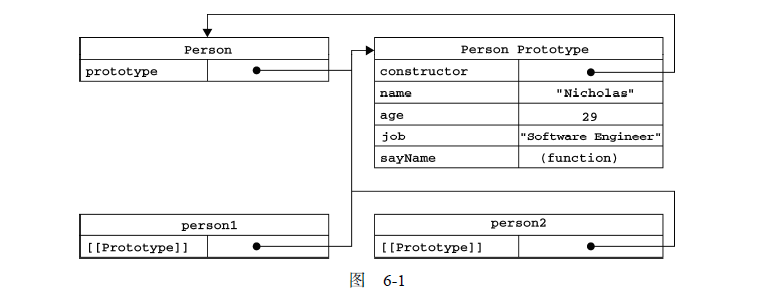
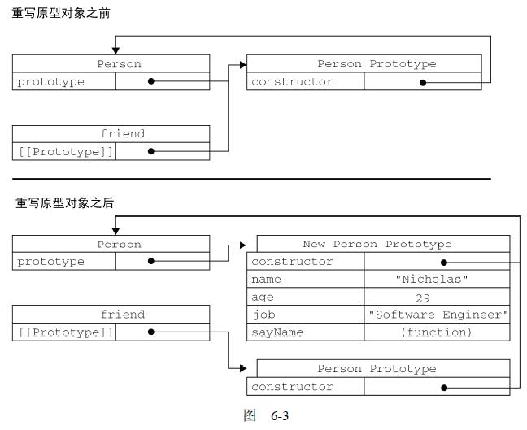
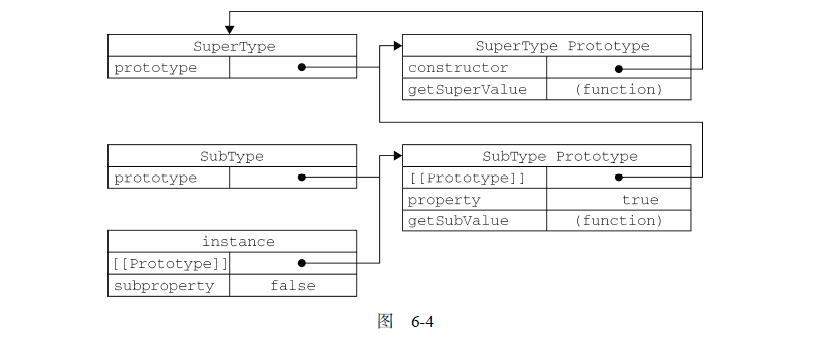
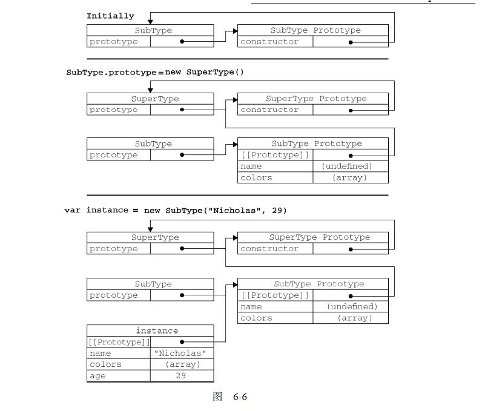

# 第6章 面向对象的程序设计

面向对象的语言有一个标志，那就是它们都有类的概念，前面提到过，ECMAScript 中没有类的概念，因此它的对象也与基于类的语言中的对象有所不同。

ECMA-262 把对象定义为：“**无序属性的集合**，其属性可以包含基本值、对象或者函数。”严格来讲，这就相当于说对象是一组没有特定顺序的值。对象的每个属性或方法都有一个名字，而每个名字都映射到一个值。正因为这样（以及其他将要讨论的原因），我们可以把ECMAScript 的对象想象成**散列表**：无非就是一组名值对，其中值可以是数据或函数。

每个对象都是基于一个引用类型创建的，这个引用类型可以是第5 章讨论的原生类型，也可以是开发人员定义的类型。

## 6.1理解对象

构造函数创建对象

```javascript
var person = new Object();
person.name = "Nicholas";
person.age = 29;
person.job = "Software Engineer";
person.sayName = function(){
    alert(this.name);
};
```

先创建一个Object 的实例person，然后再为它添加属性和方法。几年后，**对象字面量**成为创建这种对象的首选模式：

```javascript
var person = {
	name: "Nicholas",
	age: 29,
	job: "Software Engineer",
	sayName: function(){
		alert(this.name);
	}
};
```

### 6.1.1属性类型

ECMAScript 中有两种属性：数据属性和访问器属性。

对象中的属性拥有某些**特性**，描述了属性（property）的各种特征，比如可枚举，可写入等等。

##### 数据属性

数据属性包含一个数据值的位置。在这个位置可以读取和写入值。数据属性有4 个描述其行为的特性：

* [[Configurable]]：表示能否通过delete 删除属性从而重新定义属性，能否修改属性的特性，或者能否把属性修改为访问器属性。像前面例子中那样直接在对象上定义的属性，它们的这个特性默认值为true。
* [[Enumerable]]：表示能否通过for-in 循环返回属性。像前面例子中那样直接在对象上定义的属性，它们的这个特性默认值为true。
* [[Writable]]：表示能否修改属性的值。像前面例子中那样直接在对象上定义的属性，它们的这个特性默认值为true。
* [[Value]]：包含这个属性的数据值。读取属性值的时候，从这个位置读；写入属性值的时候，把新值保存在这个位置。这个特性的默认值为undefined。

要修改属性默认的特性，必须使用ECMAScript 5 的Object.defineProperty()方法。这个方法接收三个参数：属性所在的对象、属性的名字和一个描述符对象。其中，描述符（descriptor）对象的属性必须是：configurable、enumerable、writable 和value。例如：

```javascript
var person = {};
Object.defineProperty(person, "name", {
	writable: false,
	value: "Nicholas"
});
alert(person.name); //"Nicholas"
person.name = "Greg";
alert(person.name); //"Nicholas"
```

在非严格模式下，赋值操作`person.name = "Greg"`将被忽略；在严格模式下，赋值操作将会导致抛出错误。

一旦把属性定义为不可配置的，就不能再把它变回可配置了。此时，再调用Object.defineProperty()方法修改**除writable 之外**的特性，都会导致错误。

在调用Object.defineProperty()方法时，如果不指定，configurable、enumerable 和writable 特性的**默认值都是false**。

##### 访问器属性

访问器属性不包含数据值；它们包含一对儿getter 和setter 函数（这两个函数都不是必需的）。在读取访问器属性时，会调用getter 函数，这个函数负责返回有效的值；在写入访问器属性时，会调用setter 函数并传入新值，这个函数负责决定如何处理数据。访问器属性有如下4 个特性：

* [[Configurable]]：表示能否通过delete 删除属性从而重新定义属性，能否修改属性的特性，或者能否把属性修改为数据属性。对于直接在对象上定义的属性，这个特性的默认值为true。
* [[Enumerable]]：表示能否通过for-in 循环返回属性。对于直接在对象上定义的属性，这个特性的默认值为true。
* [[Get]]：在读取属性时调用的函数。默认值为undefined。
* [[Set]]：在写入属性时调用的函数。默认值为undefined。

访问器属性不能直接定义，必须使用Object.defineProperty()来定义：

```javascript
var book = {
	_year: 2004,
	edition: 1
};
Object.defineProperty(book, "year", {
	get: function(){
	return this._year;
	},
	set: function(newValue){
		if (newValue > 2004) {
			this._year = newValue;
			this.edition += newValue - 2004;
		}
	}
});
book.year = 2005;
alert(book.edition); //2
```

> 不一定非要同时指定getter 和setter。只指定getter 意味着属性是不能写，尝试写入属性会被忽略。
> 在严格模式下，尝试写入只指定了getter 函数的属性会抛出错误。类似地，只指定setter 函数的属性也不能读，否则在非严格模式下会返回undefined，而在严格模式下会抛出错误。

以前要创建访问器属性， 一般都使用两个非标准的方法：defineGetter__()和__defineSetter()

```javascript
var book = {
	_year: 2004,
	edition: 1
};
//定义访问器的旧有方法
book.__defineGetter__("year", function(){
	return this._year;
});
book.__defineSetter__("year", function(newValue){
	if (newValue > 2004) {
		this._year = newValue;
		this.edition += newValue - 2004;
	}
});
book.year = 2005;
alert(book.edition); //2
```

### 6.1.2定义多个属性

ECMAScript 5 又定义了一个Object.defineProperties()方法。利用这个方法可以通过描述符一次定义**多个属性**。这个方法接收两个对象参数：第一个对象是要添加和修改其属性的对象，第二个对象的属性与第一个对象中要添加或修改的属性一一对应。例如：

```javascript
var book = {};
Object.defineProperties(book, {
	_year: {
		value: 2004
	},
	edition: {
		value: 1
	},
	year: {
		get: function(){
  		return this._year;
	},
	set: function(newValue){
		if (newValue > 2004) {
			this._year = newValue;
			this.edition += newValue - 2004;
		}
	}
}
});
```

> 支持Object.defineProperties()方法的浏览器有IE9+、Firefox 4+、Safari 5+、Opera 12+和Chrome。

### 6.1.3读取属性的特性

使用ECMAScript 5 的Object.getOwnPropertyDescriptor()方法，可以取得给定属性的描述符。这个方法接收两个参数：属性所在的对象和要读取其描述符的属性名称，返回值是一个对象。

如果是访问器属性，这个对象的属性有configurable、enumerable、get 和set；如果是数据属性，这个对象的属性有configurable、enumerable、writable 和value。

```javascript
var book = {};
Object.defineProperties(book, {
	_year: {
		value: 2004
	},
	edition: {
		value: 1
	},
	year: {
		get: function(){
		return this._year;
		},
		set: function(newValue){
			if (newValue > 2004) {
			this._year = newValue;
			this.edition += newValue - 2004;
			}
		}
	}
});
var descriptor = Object.getOwnPropertyDescriptor(book, "_year");
alert(descriptor.value); //2004
alert(descriptor.configurable); //false
alert(typeof descriptor.get); //"undefined"
var descriptor = Object.getOwnPropertyDescriptor(book, "year");
alert(descriptor.value); //undefined
alert(descriptor.enumerable); //false
alert(typeof descriptor.get); //"function"
```

> 在JavaScript 中，可以针对任何对象——包括 DOM 和BOM 对象，使用Object.getOwnPropertyDescriptor()方法。支持这个方法的浏览器有IE9+、Firefox 4+、Safari 5+、Opera 12+和Chrome。

## 6.2创建对象

虽然Object 构造函数或对象字面量都可以用来创建单个对象，但这些方式有个明显的缺点：使用同一个接口创建很多对象，会产生大量的重复代码。为解决这个问题，人们开始使用**工厂模式**的一种变体。

### 6.2.1工厂模式

工厂模式是软件工程领域一种广为人知的设计模式，这种模式抽象了创建具体对象的过程。

考虑到在ECMAScript 中无法创建类，开发人员就发明了一种函数，用函数来封装以特定接口创建对象的细节，如下面的例子所示。

```javascript
function createPerson(name, age, job){
	var o = new Object();
	o.name = name;
	o.age = age;
	o.job = job;
	o.sayName = function(){
		alert(this.name);
	};
	return o;
}
var person1 = createPerson("Nicholas", 29, "Software Engineer");
var person2 = createPerson("Greg", 27, "Doctor");
```

函数createPerson()能够根据接受的参数来构建一个包含所有必要信息的Person 对象。可以无数次地调用这个函数，而每次它都会返回一个包含三个属性一个方法的对象。

工厂模式虽然解决了创建多个相似对象的问题，但却没有解决对象识别的问题（即怎样知道一个对象的类型）。随着JavaScript的发展，又一个新模式出现了。

### 6.2.2构造函数模式

像Object 和Array 这样的原生构造函数，在运行时会自动出现在执行环境中。此外，也可以创建**自定义的构造函数**，从而定义自定义对象类型的属性和方法。例如，可以使用构造函数模式将前面的例子重写如下。

```javascript
function Person(name, age, job){
	this.name = name;
	this.age = age;
	this.job = job;
	this.sayName = function(){
		alert(this.name);
	};
}
var person1 = new Person("Nicholas", 29, "Software Engineer");
var person2 = new Person("Greg", 27, "Doctor");
```

按照惯例，构造函数始终都应该**以一个大写字母开头**，而非构造函数则应该以一个小写字母开头。这个做法借鉴自其他OO 语言，主要是为了区别于ECMAScript 中的其他函数；因为构造函数本身也是函数，只不过可以用来创建对象而已。

要创建Person 的新实例，必须使用new 操作符。以这种方式调用构造函数实际上会经历以下4个步骤：

1. 创建一个新对象
2. 将构造函数的作用域赋给新对象（因此this 就指向了这个新对象）
3. 执行构造函数中的代码（为这个新对象添加属性）
4. 返回新对象

##### 将构造函数当作函数

构造函数与其他函数的唯一区别，就在于调用它们的方式不同。不过，构造函数毕竟也是函数，不存在定义构造函数的特殊语法。任何函数，只要通过new 操作符来调用，那它就可以作为构造函数；而任何函数，如果不通过new 操作符来调用，那它跟普通函数也不会有什么两样。例如，前面例子中定义的Person()函数可以通过下列任何一种方式来调用。

```javascript
// 当作构造函数使用
var person = new Person("Nicholas", 29, "Software Engineer");
person.sayName(); //"Nicholas"
// 作为普通函数调用
Person("Greg", 27, "Doctor"); // 添加到window
window.sayName(); //"Greg"
// 在另一个对象的作用域中调用
var o = new Object();
Person.call(o, "Kristen", 25, "Nurse");
o.sayName(); //"Kristen"
```

##### 构造函数的问题

使用构造函数的主要问题，就是每个方法都要在每个实例上**重新创建了一遍**。在前面的例子中，person1 和person2 都有一个名为sayName()的方法，但那两个方法**不是同一个Function 的实例**。

因此，不同实例上的同名函数是不相等的，以下代码可以证明这一点。

```javascript
alert(person1.sayName == person2.sayName); //false
```

创建两个完成同样任务的Function 实例的确没有必要；况且有this 对象在，根本不用在执行代码前就把函数绑定到特定对象上面。因此，大可像下面这样，通过把函数定义转移到构造函数外部来解决这个问题。

```javascript
function Person(name, age, job){
	this.name = name;
	this.age = age;
	this.job = job;
	this.sayName = sayName;
}
function sayName(){
	alert(this.name);
}
var person1 = new Person("Nicholas", 29, "Software Engineer");
var person2 = new Person("Greg", 27, "Doctor");
```

可是新问题又来了：在全局作用域中定义的函数实际上只能被某个对象调用，这让全局作用域有点名不副实。而更让人无法接受的是：如果对象需要定义很多方法，那么就要定义很多个全局函数，于是我们这个自定义的引用类型就丝毫没有封装性可言了。好在，这些问题可以通过使用**原型模式**来解决。

### 6.2.3原型模式

我们创建的每个函数都有一个prototype（原型）属性，这个属性是一个指针，指向一个对象，而这个对象的用途是包含可以由特定类型的**所有实例共享**的属性和方法。

使用原型对象的好处是可以让所有对象实例共享它所包含的属性和方法。

```javascript
function Person(){
}
Person.prototype.name = "Nicholas";
Person.prototype.age = 29;
Person.prototype.job = "Software Engineer";
Person.prototype.sayName = function(){
	alert(this.name);
};
var person1 = new Person();
person1.sayName(); //"Nicholas"
var person2 = new Person();
person2.sayName(); //"Nicholas"
alert(person1.sayName == person2.sayName); //true
```

>  与构造函数模式不同的是，新对象的这些属性和方法是由所有实例共享的。换句话说，person1 和person2 访问的都是同一组属性和同一个sayName()函数。

##### 理解原型对象

只要创建了一个新函数，就会根据一组特定的规则为该函数创建一个prototype属性，这个属性指向函数的原型对象。

在默认情况下，所有原型对象都会自动获得一个constructor（构造函数）属性，这个属性包含一个指向prototype 属性所在函数的指针。

创建了自定义的构造函数之后，其原型对象默认只会取得constructor 属性；至于其他方法，则都是从Object 继承而来的。

当调用构造函数创建一个新实例后，该实例的内部将包含一个指针（内部属性），指向构造函数的原型对象。

以前面使用Person 构造函数和Person.prototype 创建实例的代码为例，图6-1 展示了各个对象之间的关系。



可以通过isPrototypeOf()方法来确定对象之间是否存在原型关系。

```javascript
alert(Person.prototype.isPrototypeOf(person1)); //true
alert(Person.prototype.isPrototypeOf(person2)); //true
```

ECMAScript 5 增加了一个新方法，叫Object.getPrototypeOf()，在所有支持的实现中，这个方法返回[[Prototype]]的值：

```javascript
alert(Object.getPrototypeOf(person1) == Person.prototype); //true
alert(Object.getPrototypeOf(person1).name); //"Nicholas"
```

> 支持这个方法的浏览器有IE9+、Firefox 3.5+、Safari 5+、Opera 12+和Chrome。

每当代码读取某个对象的某个属性时，都会执行一次搜索，目标是具有给定名字的属性。搜索首先从对象实例本身开始。如果在实例中找到了具有给定名字的属性，则返回该属性的值；如果没有找到，则继续搜索指针指向的原型对象，在原型对象中查找具有给定名字的属性。如果在原型对象中找到了这个属性，则返回该属性的值。

当为对象实例添加一个属性时，这个属性就会**屏蔽**原型对象中保存的同名属性；换句话说，添加这个属性只会阻止我们访问原型中的那个属性，但不会修改那个属性。即使将这个属性设置为null，也只会在实例中设置这个属性，而不会恢复其指向原型的连接。不过，使用delete 操作符则可以完全删除实例属性，从而让我们能够重新访问原型中的属性，如下所示。

```javascript
function Person(){
}
Person.prototype.name = "Nicholas";
Person.prototype.age = 29;
Person.prototype.job = "Software Engineer";
Person.prototype.sayName = function(){
	alert(this.name);
};
var person1 = new Person();
var person2 = new Person();
person1.name = "Greg";
alert(person1.name); //"Greg"——来自实例
alert(person2.name); //"Nicholas"——来自原型

delete person1.name;
alert(person1.name); //"Nicholas"——来自原型
```

使用hasOwnProperty()方法可以检测一个属性是存在于实例中，还是存在于原型中。这个方法（不
要忘了它是从Object 继承来的）只在给定属性存在于对象实例中时，才会返回true：

```javascript
function Person(){
}
Person.prototype.name = "Nicholas";
Person.prototype.age = 29;
Person.prototype.job = "Software Engineer";
Person.prototype.sayName = function(){
	alert(this.name);
};
var person1 = new Person();
var person2 = new Person();
alert(person1.hasOwnProperty("name")); //false
person1.name = "Greg";
alert(person1.name); //"Greg"——来自实例
alert(person1.hasOwnProperty("name")); //true
alert(person2.name); //"Nicholas"——来自原型
alert(person2.hasOwnProperty("name")); //false
delete person1.name;
alert(person1.name); //"Nicholas"——来自原型
alert(person1.hasOwnProperty("name")); //false
```

##### 原型与in 操作符

有两种方式使用in 操作符：单独使用和在for-in 循环中使用。在单独使用时，in 操作符会在通过对象能够访问给定属性时返回true，无论该属性存在于实例中还是原型中。看一看下面的例子。

```javascript
function Person(){
}
Person.prototype.name = "Nicholas";
Person.prototype.age = 29;
Person.prototype.job = "Software Engineer";
Person.prototype.sayName = function(){
	alert(this.name);
};
var person1 = new Person();
var person2 = new Person();
alert(person1.hasOwnProperty("name")); //false
alert("name" in person1); //true
person1.name = "Greg";
alert(person1.name); //"Greg" ——来自实例
alert(person1.hasOwnProperty("name")); //true
alert("name" in person1); //true
alert(person2.name); //"Nicholas" ——来自原型
alert(person2.hasOwnProperty("name")); //false
alert("name" in person2); //true
delete person1.name;
alert(person1.name); //"Nicholas" ——来自原型
alert(person1.hasOwnProperty("name")); //false
alert("name" in person1); //true
```

同时使用hasOwnProperty()方法和in 操作符，就可以确定该属性到底是存在于对象中，还是存在于
原型中，如下所示。

```javascript
function hasPrototypeProperty(object, name){
	return !object.hasOwnProperty(name) && (name in object);
}
```

在使用for-in 循环时，返回的是所有能够通过对象访问的、可枚举的（enumerated）属性，其中既包括存在于实例中的属性，也包括存在于原型中的属性。

**屏蔽了原型中不可枚举属性（即将[[Enumerable]]标记为false 的属性）的实例属性也会在for-in 循环中返回**，因为根据规定，所有开发人员定义的属性都是可枚举的——只有在IE8 及更早版本中例外。

IE 早期版本的实现中存在一个bug，即屏蔽不可枚举属性的实例属性不会出现在for-in 循环中。例如：

```javascript
var o = {
	toString : function(){
		return "My Object";
	}
};
for (var prop in o){
	if (prop == "toString"){
		alert("Found toString"); //在IE 中不会显示
	}
}
```

解释：在IE 中，由于其实现认为原型的toString()方法被打上了值为false 的[[Enumerable]]标记，因此应该跳过该属性，结果我们就不会看到警告框。

要取得对象上所有可枚举的实例属性，可以使用ECMAScript 5 的Object.keys()方法。这个方法接收一个对象作为参数，返回一个包含所有可枚举属性的字符串数组。

```javascript
function Person(){
}
Person.prototype.name = "Nicholas";
Person.prototype.age = 29;
Person.prototype.job = "Software Engineer";
Person.prototype.sayName = function(){
	alert(this.name);
};
var keys = Object.keys(Person.prototype);
alert(keys); //"name,age,job,sayName"
var p1 = new Person();
p1.name = "Rob";
p1.age = 31;
var p1keys = Object.keys(p1);
alert(p1keys); //"name,age"
```

如果你想要得到所有实例属性，无论它是否可枚举，都可以使用Object.getOwnPropertyNames()方法。

```javascript
var keys = Object.getOwnPropertyNames(Person.prototype);
alert(keys); //"constructor,name,age,job,sayName"
```

##### 更简单的原型语法

为减少不必要的输入，也为了从视觉上更好地封装原型的功能，更常见的做法是用一个包含所有属性和方法的对象字面量来重写整个原型对象，如下面的例子所示。

```javascript
function Person(){
}
Person.prototype = {
	name : "Nicholas",
	age : 29,
	job: "Software Engineer",
	sayName : function () {
		alert(this.name);
	}
};
```

注意，我们在这里使用的语法，本质上完全重写了默认的prototype 对象，constructor 属性不再指向Person 了：

```javascript
var friend = new Person();
alert(friend instanceof Object); //true
alert(friend instanceof Person); //true
alert(friend.constructor == Person); //false
alert(friend.constructor == Object); //true
```

如果constructor 的值真的很重要，可以像下面这样特意将它设置回适当的值。

```javascript
function Person(){
}
Person.prototype = {
	constructor : Person,
	name : "Nicholas",
	age : 29,
	job: "Software Engineer",
	sayName : function () {
		alert(this.name);
	}
};
```

>  以这种方式重设constructor 属性会导致它的[[Enumerable]]特性被设置为true。

##### 原型的动态性

由于在原型中查找值的过程是一次搜索，因此我们对原型对象所做的任何修改都能够立即从实例上反映出来——即使是先创建了实例后修改原型也照样如此。

```javascript
var friend = new Person();
Person.prototype.sayHi = function(){
	alert("hi");
};
friend.sayHi(); //"hi"（没有问题！）
```

但如果是重写整个原型对象，那么情况就不一样了。我们知道，调用构造函数时会为实例添加一个指向最初原型的
[[Prototype]]指针，而把原型修改为另外一个对象就等于切断了构造函数与最初原型之间的联系。

```javascript
function Person(){
}
var friend = new Person();
Person.prototype = {
	constructor: Person,
	name : "Nicholas",
	age : 29,
	job : "Software Engineer",
	sayName : function () {
		alert(this.name);
	}
};
friend.sayName(); //error
```

图6-3 展示了这个过程的内幕。



##### 原生对象的原型

所有原生引用类型（Object、Array、String，等等）都在其构造函数的原型上定义了方法。
例如，在Array.prototype 中可以找到sort()方法，而在String.prototype 中可以找到substring()方法，如下所示。

```javascript
alert(typeof Array.prototype.sort); //"function"
alert(typeof String.prototype.substring); //"function"
```

通过原生对象的原型，不仅可以取得所有默认方法的引用，而且也可以定义新方法。

```javascript
String.prototype.startsWith = function (text) {
	return this.indexOf(text) == 0;
};
var msg = "Hello world!";
alert(msg.startsWith("Hello")); //true
```

##### 原型对象的问题

原型模式的最大问题是由其**共享的本性**所导致的。

原型中所有属性是被很多实例共享的，这种共享对于函数非常合适。对于那些包含基本值的属性倒也说得过去，毕竟（如前面的例子所示），通过在实例上添加一个同名属性，可以隐藏原型中的对应属性。然而，对于包含引用类型值的属性来说，问题就比较突出了。来看下面的例子。

```javascript
function Person(){
}
Person.prototype = {
	constructor: Person,
	name : "Nicholas",
	age : 29,
	job : "Software Engineer",
	friends : ["Shelby", "Court"],
	sayName : function () {
		alert(this.name);
	}
};
var person1 = new Person();
var person2 = new Person();
person1.friends.push("Van");
alert(person1.friends); //"Shelby,Court,Van"
alert(person2.friends); //"Shelby,Court,Van"
alert(person1.friends === person2.friends); //true
```

### 6.2.4组合使用构造函数模式和原型模式

创建自定义类型的最常见方式，就是组合使用构造函数模式与原型模式。

构造函数模式用于定义**实例属性**，而原型模式用于定义方法和共享的属性。结果，每个实例都会有自己的一份实例属性的副本，但同时又共享着对方法的引用，最大限度地节省了内存。

另外，这种混成模式还支持向构造函数传递参数；可谓是集两种模式之长。下面的代码重写了前面的例子。

```javascript
function Person(name, age, job){
	this.name = name;
	this.age = age;
	this.job = job;
	this.friends = ["Shelby", "Court"];
}
Person.prototype = {
	constructor : Person,
	sayName : function(){
		alert(this.name);
	}
}
var person1 = new Person("Nicholas", 29, "Software Engineer");
var person2 = new Person("Greg", 27, "Doctor");
person1.friends.push("Van");
alert(person1.friends); //"Shelby,Count,Van"
alert(person2.friends); //"Shelby,Count"
alert(person1.friends === person2.friends); //false
alert(person1.sayName === person2.sayName); //true
```

这种构造函数与原型混成的模式，是目前在ECMAScript 中使用**最广泛、认同度最高**的一种创建自定义类型的方法。可以说，这是用来定义引用类型的一种默认模式。

### 6.2.5动态原型模式

可以通过检查某个应该存在的方法是否有效，来决定是否需要初始化原型。

```javascript
function Person(name, age, job){
	//属性
	this.name = name;
	this.age = age;
	this.job = job;
  	//方法
	if (typeof this.sayName != "function"){
		Person.prototype.sayName = function(){
			alert(this.name);
		};
    }
}
var friend = new Person("Nicholas", 29, "Software Engineer");
friend.sayName();
```

这段代码只会在**初次调用构造函数**时才会执行。此后，原型已经完成初始化，不需要再做什么修改了。

这里对原型所做的修改，能够立即在所有实例中得到反映。因此，这种方法确实可以说非常完美。

其中，if 语句检查的可以是初始化之后应该存在的任何属性或方法——不必用一大堆if 语句检查每个属性和每个方法；只要检查其中一个即可。

### 6.2.6寄生构造函数模式

通常，在前述的几种模式都不适用的情况下，可以使用寄生（parasitic）构造函数模式。这种模式的基本思想是创建一个函数，该函数的作用**仅仅是封装创建对象的代码**，然后再返回新创建的对象；但从表面上看，这个函数又很像是典型的构造函数。下面是一个例子。

```javascript
function Person(name, age, job){
	var o = new Object();
	o.name = name;
	o.age = age;
	o.job = job;
	o.sayName = function(){
		alert(this.name);
	};
	return o;
}
var friend = new Person("Nicholas", 29, "Software Engineer");
friend.sayName(); //"Nicholas"
```

除了使用new 操作符并把使用的包装函数叫做构造函数之外，这个模式跟工厂模式其实是一模一样的。构造函数在不返回值的情况下，默认会返回新对象实例。而通过在构造函数的末尾添加一个return 语句，可以重写调用构造函数时返回的值。

这个模式可以在特殊的情况下用来为对象创建构造函数。假设我们想创建一个具有额外方法的特殊数组。由于不能直接修改Array 构造函数，因此可以使用这个模式：

```javascript
function SpecialArray(){
	//创建数组
	var values = new Array();
	//添加值
	values.push.apply(values, arguments);
	//添加方法
	values.toPipedString = function(){
		return this.join("|");
	};
	//返回数组
	return values;
}
var colors = new SpecialArray("red", "blue", "green");
alert(colors.toPipedString()); //"red|blue|green"
```

在这个例子中，我们创建了一个名叫SpecialArray 的构造函数。在这个函数内部，首先创建了一个数组，然后push()方法（用构造函数接收到的所有参数）初始化了数组的值。随后，又给数组实例添加了一个toPipedString()方法，该方法返回以竖线分割的数组值。最后，将数组以函数值的形式返回。接着，我们调用了SpecialArray 构造函数，向其中传入了用于初始化数组的值，此后又调用了toPipedString()方法。

> 构造函数返回的对象与在构造函数外部创建的对象没有什么不同。为此，不能依赖instanceof 操作符来确定对象类型。由于存在上述问题，我们建议在可以使用其他模式的情况下，不要使用这种模式。

### 6.2.7稳妥构造函数模式

道格拉斯·克罗克福德（Douglas Crockford）发明了JavaScript 中的稳妥对象（durable objects）这
个概念。所谓稳妥对象，指的是**没有公共属性**，而且其方法也**不引用this** 的对象。

稳妥对象最适合在一些安全的环境中（这些环境中会禁止使用this 和new），或者在防止数据被其他应用程序（如Mashup程序）改动时使用。

稳妥构造函数遵循与寄生构造函数类似的模式，但有两点不同：一是新创建对象的实例方法不引用this；二是不使用new 操作符调用构造函数。按照稳妥构造函数的要求，可以将前面的Person 构造函数重写如下。

```javascript
function Person(name, age, job){
	//创建要返回的对象
	var o = new Object();
	//可以在这里定义私有变量和函数
	//添加方法
	o.sayName = function(){
		alert(name);
	};
	//返回对象
	return o;
}
```

这样，变量friend 中保存的是一个稳妥对象，而除了调用sayName()方法外，没有别的方式可以访问其数据成员。即使有其他代码会给这个对象添加方法或数据成员，但也不可能有别的办法访问传入到构造函数中的原始数据。

## 6.3继承

继承是OO 语言中的一个最为人津津乐道的概念。许多OO 语言都支持两种继承方式：**接口继承**和**实现继承**。

接口继承只继承方法签名，而实现继承则继承实际的方法。

如前所述，由于函数没有签名，在ECMAScript 中无法实现接口继承。**ECMAScript 只支持实现继承**，而且其实现继承主要是依靠原型链来实现的。

简单回顾一下构造函数、原型和实例的关系：每个构造函数都有一个原型对象，原型对象都包含一个指向构造函数的指针，而实例都包含一个指向原型对象的内部指针。那么，假如我们让原型对象等于另一个类型的实例，结果会怎么样呢？显然，此时的原型对象将包含一个指向另一个原型的指针，相应地，另一个原型中也包含着一个指向另一个构造函数的指针。假如另一个原型又是另一个类型的实例，那么上述关系依然成立，如此层层递进，就构成了实例与原型的链条。这就是所谓原型链的基本概念。

实现原型链有一种基本模式，其代码大致如下。

```javascript
function SuperType(){
	this.property = true;
}
SuperType.prototype.getSuperValue = function(){
	return this.property;
};
function SubType(){
	this.subproperty = false;
}
//继承了SuperType
SubType.prototype = new SuperType();
SubType.prototype.getSubValue = function (){
	return this.subproperty;
};
var instance = new SubType();
alert(instance.getSuperValue());
```

这个例子中的实例以及构造函数和原型之间的关系如图6-4 所示。



继承是通过创建SuperType 的实例，并将该实例赋给SubType.prototype 实现的。实现的本质是重写原型对象，代之以一个新类型的实例。换句话说，原来存在于SuperType 的实例中的所有属性和方法，现在也存在于SubType.prototype 中了。在确立了继承关系之后，我们给SubType.prototype 添加了一个方法，这样就在继承了SuperType 的属性和方法的基础上又添加了一个新方法。

> 注意instance.constructor 现在指向的是SuperType，这是因为原来SubType.prototype 中的constructor 被重写了的缘故。

##### 1. 别忘记默认的原型

事实上，前面例子中展示的原型链还少一环。我们知道，**所有引用类型默认都继承了Object**，而这个继承也是通过原型链实现的。大家要记住，所有函数的默认原型都是Object 的实例，因此**默认原型都会包含一个内部指针，指向Object.prototype**。这也正是所有自定义类型都会继承toString()、valueOf()等默认方法的根本原因。所以，我们说上面例子展示的原型链中还应该包括另外一个继承层次。图6-5 为我们展示了该例子中完整的原型链。


一句话，SubType 继承了SuperType，而SuperType 继承了Object。当调用instance.toString()时，实际上调用的是保存在Object.prototype 中的那个方法。

##### 2. 确定原型和实例的关系

可以通过两种方式来确定原型和实例之间的关系。第一种方式是使用instanceof 操作符，只要用这个操作符来测试**实例与原型链中出现过的构造函数**，结果就会返回true

```javascript
alert(instance instanceof Object); //true
alert(instance instanceof SuperType); //true
alert(instance instanceof SubType); //true
```

第二种方式是使用isPrototypeOf()方法。同样，只要是**原型链中出现过的原型**，都可以说是该原型链所派生的实例的原型，因此isPrototypeOf()方法也会返回true，如下所示。

```javascript
alert(Object.prototype.isPrototypeOf(instance)); //true
alert(SuperType.prototype.isPrototypeOf(instance)); //true
alert(SubType.prototype.isPrototypeOf(instance)); //true
```

##### 3. 谨慎地定义方法

子类型有时候需要重写超类型中的某个方法，或者需要添加超类型中不存在的某个方法。但不管怎样，**给原型添加方法的代码一定要放在替换原型的语句之后**。来看下面的例子。

```javascript
function SuperType(){
	this.property = true;
}
SuperType.prototype.getSuperValue = function(){
	return this.property;
};
function SubType(){
	this.subproperty = false;
}
//继承了SuperType
SubType.prototype = new SuperType();
//添加新方法
SubType.prototype.getSubValue = function (){
	return this.subproperty;
};
//重写超类型中的方法
SubType.prototype.getSuperValue = function (){
	return false;
};
var instance = new SubType();
alert(instance.getSuperValue()); //false
```

还有一点需要提醒读者，即在通过原型链实现继承时，不能使用对象字面量创建原型方法。因为这样做就会**重写原型链**，如下面的例子所示。

```javascript
function SuperType(){
	this.property = true;
}
SuperType.prototype.getSuperValue = function(){
	return this.property;
};
function SubType(){
	this.subproperty = false;
}
//继承了SuperType
SubType.prototype = new SuperType();
//使用字面量添加新方法，会导致上一行代码无效
SubType.prototype = {
	getSubValue : function (){
		return this.subproperty;
	},
	someOtherMethod : function (){
		return false;
	}
};
var instance = new SubType();
alert(instance.getSuperValue()); //error!
```

以上代码展示了刚刚把SuperType 的实例赋值给原型，紧接着又将原型替换成一个对象字面量而导致的问题。由于现在的原型包含的是一个Object 的实例，而非SuperType 的实例，因此我们设想中的原型链已经被**切断**——SubType 和SuperType 之间已经没有关系了。

##### 4. 原型链的问题

原型链虽然很强大，可以用它来实现继承，但它也存在一些问题。其中，最主要的问题来自包含引用类型值的原型。下列代码可以用来说明这个问题。

```javascript
function SuperType(){
	this.colors = ["red", "blue", "green"];
}
function SubType(){
}
//继承了SuperType
SubType.prototype = new SuperType();
var instance1 = new SubType();
instance1.colors.push("black");
alert(instance1.colors); //"red,blue,green,black"
var instance2 = new SubType();
alert(instance2.colors); //"red,blue,green,black"
```

SubType 的所有实例都会共享这一个colors 属性。而我们对instance1.colors 的修改能够通过instance2.colors 反映出来，就已经充分证实了这一点。

原型链的第二个问题是：在创建子类型的实例时，不能向超类型的构造函数中传递参数。实际上，应该说是没有办法在不影响所有对象实例的情况下，给超类型的构造函数传递参数。

有鉴于此，再加上前面刚刚讨论过的由于原型中包含引用类型值所带来的问题，实践中很少会单独使用原型链。

### 6.3.1 原型链


### 6.3.2借用构造函数

在解决原型中包含引用类型值所带来问题的过程中，开发人员开始使用一种叫做**借用构造函数**（constructor stealing）的技术（有时候也叫做伪造对象或经典继承）。这种技术的基本思想相当简单，即在子类型构造函数的内部调用超类型构造函数。别忘了，函数只不过是在特定环境中执行代码的对象，因此通过使用apply()和call()方法也可以在（将来）新创建的对象上执行构造函数，如下所示：

```javascript
function SuperType(){
	this.colors = ["red", "blue", "green"];
}
function SubType(){
	//继承了SuperType
	SuperType.call(this);
}
var instance1 = new SubType();
instance1.colors.push("black");
alert(instance1.colors); //"red,blue,green,black"
var instance2 = new SubType();
alert(instance2.colors); //"red,blue,green"
```

通过使用call()方法（或apply()方法也可以），我们实际上是在（未来将要）新创建的SubType 实例的环境下调用了SuperType 构造函数。这样一来，就会在新SubType 对象上执行SuperType()函数中定义的所有对象初始化代码。结果，SubType 的每个实例就都会具有自己的colors 属性的副本了。

##### 1. 传递参数

相对于原型链而言，借用构造函数有一个很大的优势，即可以在子类型构造函数中向超类型构造函数传递参数。看下面这个例子。

```javascript
function SuperType(name){
	this.name = name;
}
function SubType(){
	//继承了SuperType，同时还传递了参数
	SuperType.call(this, "Nicholas");
	//实例属性
	this.age = 29;
}
var instance = new SubType();
alert(instance.name); //"Nicholas";
alert(instance.age); //29
```

为了确保SuperType 构造函数不会重写子类型的属性，可以在调用超类型构造函数后，再添加应该在子类型中定义的属性。

##### 2. 借用构造函数的问题

如果仅仅是借用构造函数，那么也将无法避免构造函数模式存在的问题——方法都在构造函数中定义，因此函数复用就无从谈起了。而且，在超类型的**原型中定义的方法**，对子类型而言也是**不可见**的，结果所有类型都只能使用构造函数模式。考虑到这些问题，借用构造函数的技术也是很少单独使用的。

### 6.3.3组合继承

组合继承（combination inheritance），有时候也叫做伪经典继承，指的是将原型链和借用构造函数的技术组合到一块，从而发挥二者之长的一种继承模式。其背后的思路是使用原型链实现对原型属性和方法的继承，而通过借用构造函数来实现对实例属性的继承。这样，既通过在原型上定义方法实现了函数复用，又能够保证每个实例都有它自己的属性。

```javascript
function SuperType(name){
	this.name = name;
	this.colors = ["red", "blue", "green"];
}
SuperType.prototype.sayName = function(){
	alert(this.name);
};
function SubType(name, age){
	//继承属性
	SuperType.call(this, name);
	this.age = age;
}
//继承方法
SubType.prototype = new SuperType();
SubType.prototype.constructor = SubType;
SubType.prototype.sayAge = function(){
	alert(this.age);
};
var instance1 = new SubType("Nicholas", 29);
instance1.colors.push("black");
alert(instance1.colors); //"red,blue,green,black"
instance1.sayName(); //"Nicholas";
instance1.sayAge(); //29
var instance2 = new SubType("Greg", 27);
alert(instance2.colors); //"red,blue,green"
instance2.sayName(); //"Greg";
instance2.sayAge(); //27
```

组合继承避免了原型链和借用构造函数的缺陷，融合了它们的优点，成为JavaScript 中**最常用的继承模式**。而且，instanceof 和isPrototypeOf()也能够用于识别基于组合继承创建的对象。

### 6.3.4原型式继承

道格拉斯·克罗克福德在2006 年写了一篇文章，在这篇文章中，他介绍了一种实现继承的方法，这种方法并没有使用严格意义上的构造函数。他的想法是借助原型可以**基于已有的对象创建新对象**，同时还不必因此创建自定义类型。为了达到这个目的，他给出了如下函数。

```javascript
function object(o){
	function F(){}
	F.prototype = o;
	return new F();
}
```

在object()函数内部，先创建了一个临时性的构造函数，然后将传入的对象作为这个构造函数的
原型，最后返回了这个临时类型的一个新实例。object()对传入其中的对象执行了一次浅复制:

```javascript
var person = {
	name: "Nicholas",
	friends: ["Shelby", "Court", "Van"]
};
var anotherPerson = object(person);
anotherPerson.name = "Greg";
anotherPerson.friends.push("Rob");
var yetAnotherPerson = object(person);
yetAnotherPerson.name = "Linda";
yetAnotherPerson.friends.push("Barbie");
alert(person.friends); //"Shelby,Court,Van,Rob,Barbie"
```

在这个例子中，可以作为另一个对象基础的是person 对象，于是我们把它传入到object()函数中，然后该函数就会返回一个新对象。这个新对象将person 作为原型，所以它的原型中就包含一个基本类型值属性和一个引用类型值属性。这意味着person.friends 不仅属于person 所有，而且也会被anotherPerson以及yetAnotherPerson 共享。

ECMAScript 5 通过新增Object.create()方法规范化了原型式继承。这个方法接收两个参数：一个用作新对象原型的对象和（可选的）一个为新对象定义额外属性的对象。在传入一个参数的情况下，Object.create()与object()方法的行为相同。

```javascript
var person = {
	name: "Nicholas",
	friends: ["Shelby", "Court", "Van"]
};
var anotherPerson = Object.create(person);
anotherPerson.name = "Greg";
anotherPerson.friends.push("Rob");
var yetAnotherPerson = Object.create(person);
yetAnotherPerson.name = "Linda";
yetAnotherPerson.friends.push("Barbie");
alert(person.friends); //"Shelby,Court,Van,Rob,Barbie"
```

Object.create()方法的第二个参数与Object.defineProperties()方法的第二个参数格式相同：每个属性都是通过自己的描述符定义的。以这种方式指定的任何属性都会覆盖原型对象上的同名属性。例如：

```javascript
var person = {
	name: "Nicholas",
	friends: ["Shelby", "Court", "Van"]
};
var anotherPerson = Object.create(person, {
	name: {
		value: "Greg"
	}
});
alert(anotherPerson.name); //"Greg"
```

### 6.3.5寄生式继承

寄生式（parasitic）继承是与原型式继承紧密相关的一种思路，并且同样也是由克罗克福德推而广之的。

寄生式继承的思路与寄生构造函数和工厂模式类似，即创建一个仅用于封装继承过程的函数，该函数在内部以某种方式来增强对象，最后再像真地是它做了所有工作一样返回对象。以下代码示范了寄生式继承模式。

```javascript
function createAnother(original){
	var clone = object(original); //通过调用函数创建一个新对象
	clone.sayHi = function(){ //以某种方式来增强这个对象
		alert("hi");
	};
	return clone; //返回这个对象
}
```

可以像下面这样来使用createAnother()函数：

```javascript
var person = {
  name: "Nicholas",
  friends: ["Shelby", "Court", "Van"]
};
var anotherPerson = createAnother(person);
anotherPerson.sayHi(); //"hi"
```

> 使用寄生式继承来为对象添加函数，会由于不能做到函数复用而降低效率；这一点与构造函数模式类似。

### 6.3.6寄生组合式继承

组合继承最大的问题就是无论什么情况下，都会调用两次超类型构造函数：一次是在创建子类型原型的时候，另一次是在子类型构造函数内部。没错，子类型最终会包含超类型对象的全部实例属性，但我们不得不在调用子类型构造函数时重写这些属性。再来看一看下面组合继承的例子。

```javascript
function SuperType(name){
	this.name = name;
	this.colors = ["red", "blue", "green"];
}
SuperType.prototype.sayName = function(){
	alert(this.name);
};
function SubType(name, age){
	SuperType.call(this, name); //第二次调用SuperType()
	this.age = age;
}
SubType.prototype = new SuperType(); //第一次调用SuperType()
SubType.prototype.constructor = SubType;
SubType.prototype.sayAge = function(){
	alert(this.age);
};
```

在第一次调用SuperType 构造函数时，SubType.prototype 会得到两个属性：name 和colors；它们都是SuperType 的实例属性，只不过现在位于SubType 的原型中。当调用SubType 构造函数时，又会调用一次SuperType 构造函数，这一次又在新对象上创建了实例属性name 和colors。于是，这两个属性就屏蔽了原型中的两个同名属性。图6-6 展示了上述过程。



如图6-6 所示，有两组name 和colors 属性：一组在实例上，一组在SubType 原型中。这就是调用两次SuperType 构造函数的结果。好在我们已经找到了解决这个问题方法——寄生组合式继承。

寄生组合式继承的基本模式如下所示:

```javascript
function inheritPrototype(subType, superType){
	var prototype = object(superType.prototype); //创建对象
	prototype.constructor = subType; //增强对象
	subType.prototype = prototype; //指定对象
}
```

在函数内部，第一步是创建超类型原型的一个副本。第二步是为创建的副本添加constructor 属性，从而弥补因重写原型而失去的默认的constructor 属性。最后一步，将新创建的对象（即副本）赋值给子类型的原型。这样，我们就可以用调用inherit-Prototype()函数的语句，去替换前面例子中为子类型原型赋值的语句了，例如：

```javascript
function SuperType(name){
	this.name = name;
	this.colors = ["red", "blue", "green"];
}
SuperType.prototype.sayName = function(){
	alert(this.name);
};
function SubType(name, age){
	SuperType.call(this, name);
	this.age = age;
}
inheritPrototype(SubType, SuperType);
SubType.prototype.sayAge = function(){
	alert(this.age);
};
```

这个例子的高效率体现在它只调用了一次SuperType 构造函数，并且因此避免了在SubType.prototype 上面创建不必要的、多余的属性。与此同时，原型链还能保持不变；因此，还能够正常使用instanceof isPrototypeOf()。开发人员普遍认为寄生组合式继承是引用类型**最理想的继承范式**。
